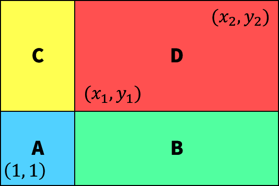
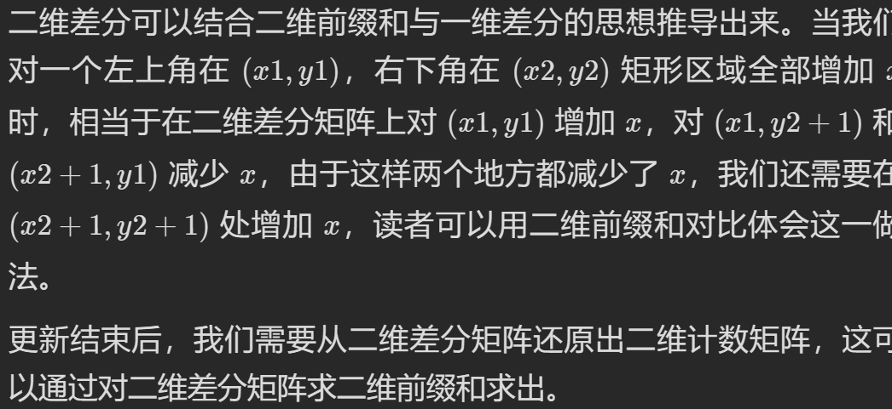

## 前缀和

- 前缀思想本质上是动态规划的一种

### 二维前缀和



```c++
//生成
vector<vector<int>>arr(mat.size()+1,vector<int>(mat[0].size()+1));
        for(int i=1;i<=mat.size();i++)
        {
            for(int j=1;j<=mat[0].size();j++)
                arr[i][j]=arr[i-1][j]+arr[i][j-1]+mat[i-1][j-1]-arr[i-1][j-1];
        }
//查询
int getnum(vector<vector<int>>&arr,int x1,int y1,int x2,int y2)
    {
        return arr[x2+1][y2+1]-arr[x2+1][y1]-arr[x1][y2+1]+arr[x1][y1];
    }
```


#### 例题

- [1292. 元素和小于等于阈值的正方形的最大边长](https://leetcode.cn/problems/maximum-side-length-of-a-square-with-sum-less-than-or-equal-to-threshold/)
- [1139. 最大的以 1 为边界的正方形](https://leetcode.cn/problems/largest-1-bordered-square/)

### 特殊前缀和

####  例题

- [1862. 向下取整数对和](https://leetcode.cn/problems/sum-of-floored-pairs/)
  - 数学、划分区间（桶）

- [1177. 构建回文串检测](https://leetcode.cn/problems/can-make-palindrome-from-substring/)

###  其他前缀

- 前缀积
  - 对于前缀积，我们可以用除法消去前 l−1 个数对结果的影响
  - 如果有零不能直接除法，需要根据0进行特殊处理
- 前缀异或
  - 可以再次异或消去前 l−1 个数对结果的影响

#### 例题

- [1352. 最后 K 个数的乘积](https://leetcode.cn/problems/product-of-the-last-k-numbers/)
  - 存在0的前缀积
- [1738. 找出第 K 大的异或坐标值 ](https://leetcode.cn/problems/find-kth-largest-xor-coordinate-value/)

## 差分

- 差分数组方便修改，但是每次查询都需要遍历一遍差分数组（做一遍前缀）来获得原数组。
- 可以快速对元素进行范围修改O(1)，但是查询性能较差O(n)
- 若将a~l~\~a~r~之间的元素全部加上k，只有a~l~-a~l-1~会增大k，a~r+1~-a~r~会减小k
  - `dif[l]+=k` `dif[r+1]-=k`

### 例题

- [1109. 航班预订统计](https://leetcode.cn/problems/corporate-flight-bookings/)

  - ```c++
    class Solution {
    public:
        vector<int> corpFlightBookings(vector<vector<int>>& bookings, int n) {
            vector<int>ans(n);
            for(auto &a:bookings)//构建差分数组
            {
                ans[a[0]-1]+=a[2];
                if(a[1]<n)
                    ans[a[1]]-=a[2];
            }
            for(int i=1;i<n;i++)//还原元素
            {
                ans[i]+=ans[i-1];
            }
            return ans;
        }
    };
    ```

- [1094. 拼车](https://leetcode.cn/problems/car-pooling/)

- [1674. 使数组互补的最少操作次数](https://leetcode.cn/problems/minimum-moves-to-make-array-complementary/)

  - 难

- [1871. 跳跃游戏 VII ](https://leetcode.cn/problems/jump-game-vii/)

- [759. 员工空闲时间](https://leetcode.cn/problems/employee-free-time/?envType=study-plan&id=shu-ju-jie-gou-jin-jie&plan=data-structures&plan_progress=chpajx1)

- 二维差分：[6292. 子矩阵元素加 1](https://leetcode.cn/problems/increment-submatrices-by-one/)

  - ```python
     # 生成差分
     diff[r1][c1] += 1
     diff[r1][c2 + 1] -= 1
     diff[r2 + 1][c1] -= 1
     diff[r2 + 1][c2 + 1] += 1
     # 前缀还原
    for i in range(1, len(state) - 1):
                 for j in range(1, len(state[0]) - 1):
                     state[i][j] += state[i][j - 1] + state[i - 1][j] - state[i - 1][j - 1]
    ```
    
  - 
  
  - [2132. 用邮票贴满网格图](https://leetcode.cn/problems/stamping-the-grid/)
