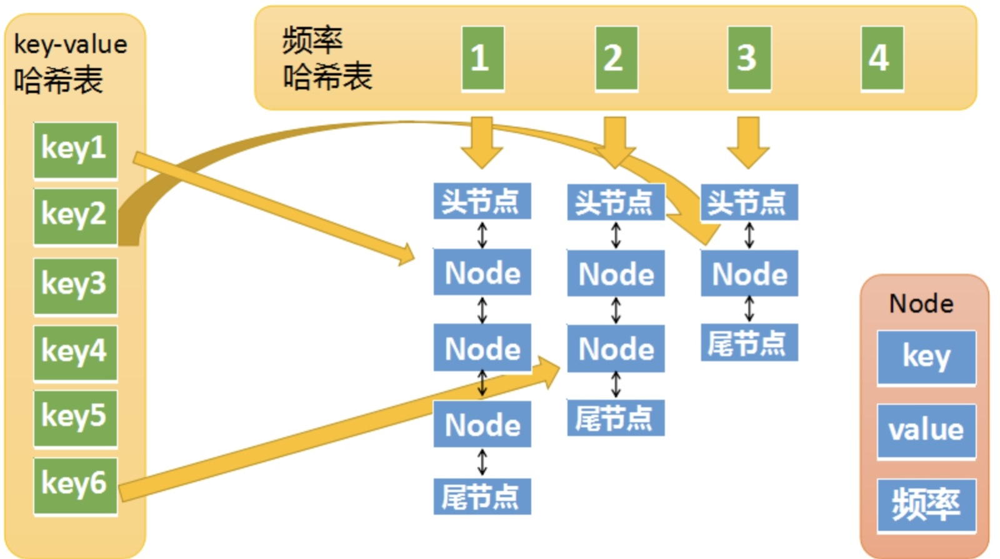
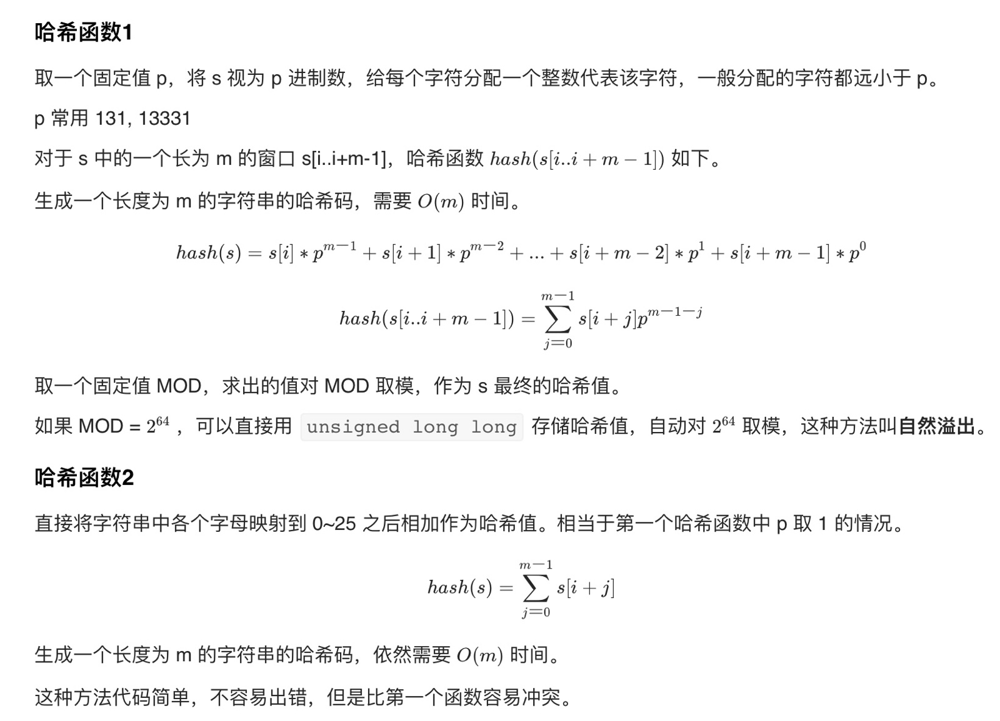

# 哈希
## 概念
- 分类
    - 闭散列表：闭散列也称为开放地址法，是在线性存储空间上的解决方案。当发生冲突时，采用冲突处理方法在线性存储空间上探测其他的位置。根据增量序列的不同，开放地址法又分为线性探测法、二次探测法等等。
        - 问题：容易产生堆积问题；需要额外的字段表示节点状态，记录数据是被删除的而不是空白的。下次查找的时候继续向后走
        - `hash‘(key) = (hash(key) + d) % m`
    - 开散列表：开散列的方案是建立一个邻接表结构，以哈希函数的值域作为邻接表的表头数组，映射后的值相同的原始信息放到同一个桶对应的链表里，插到相应的表头上。相当于在哈希表每一个节点持有一个链表，某个数据项对的关键字还是像通常一样映射到哈希表的节点中，而数据项本身插入到节点持有的链表中。发生冲突时，在链表后面追加数据。
        - 问题：存储的记录是随机分布在内存中的，这样在查询记录时，相比结构紧凑的数据类型，哈希表的跳转访问会带来额外的时间开销。
## 应用
### 分桶算法
- 分桶法是把一排元素(key)按照某种标准放到各个桶中，每个桶分别维护自己内部的信息，外部只需要管理各个桶即可，提高计算的效率。
#### [桶排序](排序.md)
分桶依据：频率、斜率及数字特征等等
### 前缀和加哈希表
- 思路，用哈希表结合实现快速查找符合条件的结果（找最长最短子数组）；
- [1590. 使数组和能被 P 整除](https://leetcode.cn/problems/make-sum-divisible-by-p/)
- [1542. 找出最长的超赞子字符串](https://leetcode.cn/problems/find-longest-awesome-substring/)
### 与其他数据结构结合
- 由于哈希表中的元素排列具有无序性，为了实现按照一定的顺序添加和删除元素，可以使用vector、list、deque等辅助记录元素顺序。
- 与平衡树结合：set、map
    - 利用其有序性方便高效的解决问题，并使用成员函数`lower_bound,upper_bound`二分搜索加速。
    - [911. 在线选举](https://leetcode.cn/problems/online-election/)
        - 结合动态规划思想，预处理出所有结果
    - [1146. 快照数组](https://leetcode.cn/problems/snapshot-array/submissions/)
    - [981. 基于时间的键值存储](https://leetcode.cn/problems/time-based-key-value-store/)
    - [1348. 推文计数](https://leetcode.cn/problems/tweet-counts-per-frequency/solution/)
```c++
class TimeMap {
public:
    TimeMap() {

    }
    
    void set(string key, string value, int timestamp) {
        check[key][timestamp]=value;
    }
    
    string get(string key, int timestamp) {
        auto it=check[key].upper_bound(timestamp);//找到第一个更大的时间
        if(it==check[key].begin())//不存在<=的元素
            return "";
        else
        {
            it--;
            return it->second;
        }
    }
    unordered_map<string,map<int,string>>check;//外层不需要有序，内层按照时间顺序进行排列
};  
```

### 与双向链表构建有顺序的字典
- [带顺序的字典](https://leetcode.cn/leetbook/read/ha-xi-si-xiang/vhkh31/)
- 可以在O（1）时间完成增删改查
- 不同排序顺序主要体现在对链表的调整不同
#### 模板
- c++中要用unordered_map和list来实现
- 带更新顺序的字典，就是在字典的基础上，在维护数据过程中需要维护数据的更新顺序。这里的更新顺序与前面提到的插入顺序的区别是，插入一个已经存在的元素的时候也算是一次更新。
- 链表是天然地具有先后顺序的线性结构，插入的时候直接在末尾插入即可，链表中的元素直接保持了插入的顺序。删除的时候我们需要查找待删除的元素在链表中的位置。链表的查找性能不好，但是可以将数据的 key 和链表节点分别作为哈希映射的键和值。这样查询的需求就可以通过哈希映射找到链表中的节点，而插入顺序直接由链表的插入维护。
- 思想：用双向链表辅助哈希表来维护一个顺序。
```c++
class OrderedDict {//以更新顺序为例
public:
    int size() {
        return linkedlist.size();
    }

    int get(char key) {//查看元素的value
        auto it = mapping.find(key);
        if(it == mapping.end())
            return -1;
        else
            return (it -> second).first;
    }

    void put(char key, int index) {//插入元素，如果已经有了就删除重新插入、
        auto it = mapping.find(key);
        if(it != mapping.end())
            remove(key);
        linkedlist.push_front(key);
        mapping.insert(pair<char, pair<int, list<char>::iterator>>(key, pair<int, list<char>::iterator>(index, linkedlist.begin())));
    }

    void remove(char key) {
        auto it = mapping.find(key);
        if(it != mapping.end())
        {
            auto iter = (it -> second).second;
            linkedlist.erase(iter);
            mapping.erase(it);
        }
    }

    int remove_bottom()//移除最先插入的元素
    {
        char key = linkedlist.back();
        int index = mapping[key].first;
        mapping.erase(mapping.find(key));
        linkedlist.pop_back();
        return index;
    }

private:
    unordered_map<char, pair<int, list<char>::iterator>> mapping;//<key,<value,链表迭代器>>(我觉得//<key,iterator>就够了)
    list<char> linkedlist;
};
```
#### 带更新顺序的字典
- 首先是常规的插入、删除、查询功能，与哈希表的插入、删除、查询一样，只是有一点变化：在插入时，如果 key 已经存在，则将对应的链表节点调度到表头。（在put时放在头）
- [340. 至多包含 K 个不同字符的最长子串](https://leetcode.cn/problems/longest-substring-with-at-most-k-distinct-characters/solution/)
    - 也可以用multiset代替，但是效率更高。
#### 带访问顺序的字典
- put 中如果达到 capacity 需要删除链表的尾部节点；get 时，如果有值，则需要将对应的链表节点调度到表头。（在put和get时放在头）
- [146.LRU缓存](https://leetcode.cn/problems/lru-cache/)
#### 带频率顺序的字典（难）
- put 中如果达到 capacity 需要删除访问次数最低的节点，当访问次数最低的节点有多个时，删最早访问的那个；get 时，如果有值，则需要将访问次数加 1 并将对应的链表节点调度到表头
- [LFU与LRU原理](https://leetcode.cn/problems/lfu-cache/solution/chao-xiang-xi-tu-jie-dong-tu-yan-shi-460-lfuhuan-c/)
- [460. LFU 缓存](https://leetcode.cn/problems/lfu-cache/)
    - 使用双哈希表，与LRU相比用一个哈希表维护出现频率<频率,双链表>，实际上对于同一出现频率内的元素相当于用许多LRU机制进行维护；另一个hash表则维护所有的元素（这与LRU是一致的）
- [432. 全 O(1) 的数据结构](https://leetcode.cn/problems/all-oone-data-structure/)
    - 数据结构微调（内层哈希表，外层双链表）
- [1224. 最大相等频率](https://leetcode.cn/problems/maximum-equal-frequency/)
    - 类似思路（双hash表）




## stl库

### 自定义hash函数
- 包含：hash<key>哈希函数和equal_to<key>比较规则(注意：自定义的两个函数必须都是双const的)
    - 哈希函数的作用: 根据各个键值对中键的值，计算出一个哈希值，哈希表可以根据该值判断出该键值对具体的存储位置。
    - 比较函数的作用: 当键是自定义对象或容器时，定义什么叫两个键相等，两个不相等的键的哈希值可能是一样的，这是哈希冲突的来源。
    - STL 中的哈希函数不是普通函数，而是一个函数对象类。因此想要自定义哈希函数，需要自定义一个函数对象类。
- hash<key>
    - 可以用提供的现成的进行组合，也可以自定义
    - 如hash<string>()(s)+hash<int>()(n)
```c++
class MyHash {
public:
    int operator()(const Point &A) const {
        return A.get_slope();//返回值自定义
    }
};
//使用
unordered_set<Point, MyHash> point_setting;//传入hash函数对象
```
- equal_to<key>
    - 如果类型定义了==则不需要再去定义equal_to<key>
    - 也可以通过直接定义equal_to<key>来实现
### 例
- [1128. 等价多米诺骨牌对的数量](https://leetcode.cn/problems/number-of-equivalent-domino-pairs/)
```c++
class Solution {
public:
    struct item{
        item(int x,int y):x(x),y(y){}
        int x,y;
        bool operator==(const item&a)const//自定义比较（什么时候对应同一个键，注意为双const）
        {
            return (x==a.x&&y==a.y)||(x==a.y&&y==a.x);
        } 
    };
    struct myhash{
        int operator()(const item&a)const//用系统提供的哈希函数
        {
            return hash<int>()(a.x)+hash<int>()(a.y);
        }
    };
    int numEquivDominoPairs(vector<vector<int>>& dominoes) {
        int ans=0;
        unordered_map<item,int,myhash>check;
        for(auto&a:dominoes)
        {
            check[item(a[0],a[1])]++;
            ans+=check[item(a[0],a[1])]-1;
        }
        return ans;
    }
};
```
## 扩展
### 字符串（数组）哈希(Rabin-Karp 算法)
- 把任意长度的数组映射成一个非负整数
- 哈希函数：
  
    - base：进制基数
    - mod：可以为一个具体值如1e9+7或通过unsigned类型自动实现。
- 可以使用前缀和进行计算
  - 前缀计算哈希值进行哈希，比使用unordered_set<string>取子串快速的多
  - 例如要长度为l的子字符串,(总长为n)，那么RK算法O(n)而普通unordered_set<string>为O(nl)
```c++
//base常用31（对字符串来说），mod:1e9+7
//定义为int类型
for (int i = 1; i <= n; ++i) {
            pre[i] = ((LL)pre[i - 1] * base + text[i - 1]) % mod;
            mul[i] = (LL)mul[i - 1] * base % mod;
        }
hash = (pre[r + 1] - (LL)pre[l] * mul[r - l + 1] % mod + mod) % mod;
//unsigned long long定义，操作方便可以自动取余并且发生哈希冲突的可能性更小
for (int i = 1; i <= n; ++i) {
            pre[i] = pre[i - 1] * base + text[i - 1];
            mul[i] = mul[i - 1] * base;
        }
hash = pre[r + 1] - (LL)pre[l] * mul[r - l + 1];
```
- 滚动计算
    - 利用滑动窗口的特性，每次滑动都有一个元素进，一个元素出，处理删除和增加的两个字符对哈希值的贡献即可。
```c++
hash_substr = hash_substr - s[i - len] * pp[len];
hash_substr = hash_substr * p;
hash_substr = hash_substr + s[i];
```
#### 应用
- [1392. 最长快乐前缀](https://leetcode.cn/problems/longest-happy-prefix/)
```c++
class Solution {
public:
    string longestPrefix(string s) {
        int n = s.size();
        int prefix = 0, suffix = 0;
        int base = 31, mod = 1000000007, mul = 1;
        int happy = 0;
        for (int i = 1; i < n; ++i) {
            //长度为i的前缀
            prefix = ((long long)prefix * base + (s[i - 1] - 97)) % mod;
            //长度为i的后缀
            suffix = (suffix + (long long)(s[n - i] - 97) * mul) % mod;
            if (prefix == suffix) {
                happy = i;
            }
            mul = (long long)mul * base % mod;
        }
        return s.substr(0, happy);
    }
};
```
- [1316. 不同的循环子字符串](https://leetcode.cn/problems/distinct-echo-substrings/)
    - 为了避免冲突，对不同长度字符串单独开辟unordered_set
- [1044. 最长重复子串](https://leetcode.cn/problems/longest-duplicate-substring/)
    - 二分优化长度选择
- [187. 重复的DNA序列](https://leetcode.cn/problems/repeated-dna-sequences/)
## 例题
- [945. 使数组唯一的最小增量](https://leetcode.cn/problems/minimum-increment-to-make-array-unique/)
    - 特·应用闭散列表思想
    - 路径压缩方法
- [939. 最小面积矩形](https://leetcode.cn/problems/minimum-area-rectangle/solution/)
    - 使用多个哈希，要设计好