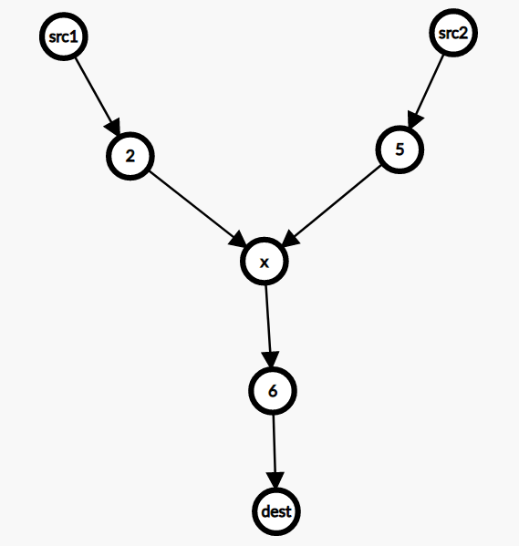
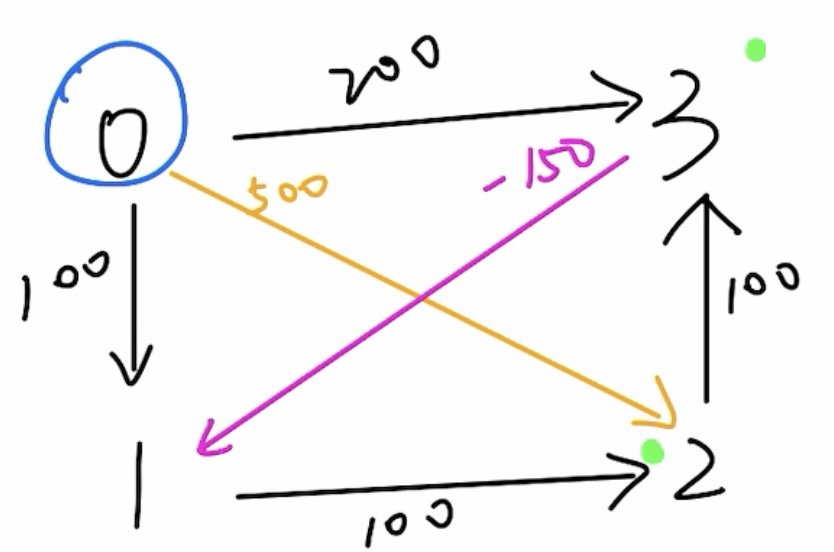
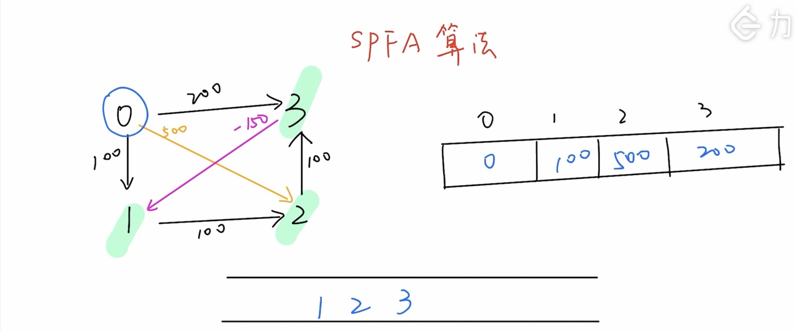

# 图论
## 并查集
### 模板
```c++
vector<int>parents;
vector<int>h;
void initiate(int n)
    {
        parents=vector<int>(n,0);
        h=vector<int>(n,1);
        for(int i=0;i<n;i++)
            parents[i]=i;
    }
    int find(int target)
    {
        if(target!=parents[target])
            parents[target]=find(parents[target]);
        return parents[target];
    }
    void merge(int x,int y)
    {
        x=find(x);
        y=find(y);
        if(x==y)
            return;
        if(h[x]<=h[y])
        {
            h[y]+=h[x];
            parents[x]=parents[y];
        }
        else
        {
            h[x]+=h[y];
            parents[y]=parents[x];
        }
    }
```
### 例题
- [1697. 检查边长度限制的路径是否存在](https://leetcode.cn/problems/checking-existence-of-edge-length-limited-paths/)
    - 结合排序优化
## Dijkstra算法

### 原理

- 用于求解带权图的**单源最短路径**问题
  - 即一点到图中任意一点的最短路径
- 过程：L(v)表示从原点s到v的最短路径，w(e)表示边的权
  - 初始化i=0，S={s}(已经遍历到的点)，L(s)=0,其他点L(v)=无穷大
  - 对于所有不在S中的点（未找到最短路径）vϵV~G~-S，L(v)=min{L(v),min uϵs{L(u)+W(u,v)}}更新
  - 找到新的具有最小L(v)的v，将其加入S
  - 直至做有点都加入S终止
- 模板

~~~c++
 vector<int> dijkstra(vector<vector<pair<int, int>>> &g, int start) {//图存储pair<目标点，权值>
        vector<int> dist(g.size(), INT_MAX);//初始化
        dist[start] = 0;//出发点
        priority_queue<pair<int, int>, vector<pair<int, int>>, greater<>> pq;//将距离与点组队，方便优先队列排序
        pq.emplace(0, start);
        while (!pq.empty()) {
            auto[d, x] = pq.top();
            pq.pop();
            if (d > dist[x]) continue;//剪枝，说明在这之后距离更小的组合被添加进入了队列，由于优先队列的性质，更小的会优先出队，也就意味这个点已经更新过了。可以直接跳过
            for (auto[y, wt] : g[x]) {//更新
                int new_d = dist[x] + wt;//从x间接到达y的距离
                if (new_d < dist[y]) {
                    dist[y] = new_d;
                    pq.emplace(new_d, y);//被更新的点都是候选点，优先队列会去选择最小的
                }
            }
        }
        return dist;
    }
~~~


### 例题

- [882. 细分图中的可到达节点](https://leetcode.cn/problems/reachable-nodes-in-subdivided-graph/)

- 自定义权值
  - [1631. 最小体力消耗路径 ](https://leetcode.cn/problems/path-with-minimum-effort/)
  - [778. 水位上升的泳池中游泳](https://leetcode.cn/problems/swim-in-rising-water/)

- [1976. 到达目的地的方案数 ](https://leetcode.cn/problems/number-of-ways-to-arrive-at-destination/submissions/)
  - 小心溢出，全要用long long，以及LONG_MAX
- [2203. 得到要求路径的最小带权子图](https://leetcode.cn/problems/minimum-weighted-subgraph-with-the-required-paths/)
  - 
  - 两个点到一个点的路径生成的子图权值和的最小值
  - 我们可以枚举三岔口的交点 x*x*，然后求 src1和 src2 到 x的最短路，以及 x 到 dest 的最短路，这可以通过在反图（即所有边反向后的图）上求从 dest出发的最短路得出。累加这三条最短路的和，即为三岔口在 x 处的子图的边权和。枚举所有 x，最小的子图的边权和即为答案。

```c++
long long minimumWeight(int n, vector<vector<int>> &edges, int src1, int src2, int dest) {
        vector<vector<pair<int, int>>> g(n), rg(n);
        for (auto &e: edges) {
            int x = e[0], y = e[1], wt = e[2];
            g[x].emplace_back(y, wt);
            rg[y].emplace_back(x, wt);
        }

        auto d1 = dijkstra(g, src1);
        、、、、auto d2 = dijkstra(g, src2);
        auto d3 = dijkstra(rg, dest);

        long ans = LONG_MAX / 3;//dijkstra中用LONG_MAX/3初始化,意味着找不到路径
        for (int x = 0; x < n; ++x)//枚举x
            ans = min(ans, d1[x] + d2[x] + d3[x]);
        return ans < LONG_MAX / 3 ? ans : -1;
    }
```
## bellman-ford（含负权值的单源最短路径/边长有限制的最短路径）
### 思路
- 定理
    - 负权环没有最短路径
    - 一个有N个顶点的非负权环中两点间最短路径最多经过N-1条边
- 动态规划思想：记录最短路径长度最长为k时的最短值
    - dp[k][u]=min(dp[k][u],dp[k-1][v]+w(u,v))
    - 优化：使用滚动数组只需要存k和k-1就行
- bellman算法
    - 只用一维数组存储（初始化为正无穷）
    - 每次选择入边最小值dp[u]=min(dp[v]+w(u,v))
    - 最多循环N-1次或dp[i]不在发生变化（已经到达最优）
    - 每次循环遍历一次所有边即可
    
- spfa算法（基于队列优化的bellman）
    - 主要是通过「队列」来维护我们接下来要遍历边的起点，而不是「Bellman Ford」算法中的任意还没有遍历过的边。每次只有当某个顶点的最短距离更新之后，并且该顶点不在「队列」中，我们就将该顶点加入到「队列」中。一直循环以上步骤，直到「队列」为空，我们就可以终止算法。此时，我们就可以得到「图」中其他顶点到给定顶点的最短距离了。
    - 从出发开始便历所有出边，更新到一个点的最短距离，如果更新了则加入队列（并标记为已经加入），之后从队列中依次取出元素进行操作，直至队列为空。
    

- 时间复杂度O($V*E$)
### 模板
- bellmen
```c++
vector<int>dp_l(n,1e7),dp(n,1e7);
        dp_l[src]=0;
        dp[src]=0;
        for(int i=0;i<=k;i++)
        {
            for(auto &a:flights)
            {
                dp[a[1]]=min(dp[a[1]],dp_l[a[0]]+a[2]);
            }
            dp_l=dp;
        }
```
- sofa
```
```
### 例题
- 变长有限制的最短路径
    - [787. K 站中转内最便宜的航班](https://leetcode.cn/problems/cheapest-flights-within-k-stops/)
## floyd算法（找到所有点之间的最短路径）
### 思想
- [flod算法](https://blog.csdn.net/m0_51339444/article/details/123904762)
- O($n^3$)
### 模板
```c++
    // 遍历每个节点k，看将该节点作为跳板后是否可以更新节点（距离变短则更新）
    for(int k = 0; k < n; ++k){
        for(int i = 0; i < n; ++i){
            for(int j = 0; j < n; ++j){
                if(d[i][k] + d[k][j] < d[i][j])
                    d[i][j] = d[i][k] + d[k][j];
            }
        }
    }
}
```

## 最小生成树
### Prime
- 维护两个数组：
    - lowcost 数组，表示V中的节点，保存V中每个节点离集合Vnew中所有节点的最短距离。如果节点已经加入到了集合Vnew中，则置为-1
    - v 数组，表示V中节点的访问情况，最开始全部为0,表示未加入到Vnew中，若某节点加入到了集合Vnew中， 则将其置为-1
- 过程
    - 随机选择一个起点，将其加入到Vnew中。同时，更新此时的数组lowcost和数组v
    - 遍历lowcost，寻找lowcost中的最小值min（假设索引为 j ，j为Vnew中离V最近的点），将与索引 j 相对应的节点加入到Vnew中，并更新数组lowcost[j]和数组v[j]。
    - 找到lowcost中的最小值 j 后，此时数组lowcost中的所有节点都要更新，因为此时集合Vnew中的节点增加了，集合V中的节点离Vnew的最近距离可能会缩短。
    - 根据新加入集合Vnew中的节点j，更新所有的lowcost。
    - 重复步骤2,直到访问了所有的节点。
- 使用数组存储复杂度为O($V^2$+E)
- 使用普通堆O($E*log(E)$)
    - 当E->$V^2$时效率低与数组
- 模板
```c++
int minCostConnectPoints(vector<vector<int>>& points) {
        vector<int>v(points.size(),1),dis(points.size(),INT_MAX);
        int ans=0;
        v[0]=0;
        dis[0]=0;
        for(int i=1;i<points.size();i++)
        {
            dis[i]=abs(points[i][0]-points[0][0])+abs(points[i][1]-points[0][1]);//以第一个点出发初始化
        }
        for(int i=1;i<points.size();i++)//依次加点
        {
            pair<int,int>t{-1,INT_MAX};
            for(int j=0;j<points.size();j++)//找到最近的点
            {
                if(v[j])
                {
                    if(dis[j]<t.second)
                    {
                        t.second=dis[j];
                        t.first=j;
                    }
                }
            }
            v[t.first]=0;
            ans+=t.second;
            for(int j=1;j<points.size();j++)//更新最近值
            {
                if(v[j])
                {
                    dis[j]=min(dis[j],abs(points[j][0]-points[t.first][0])+abs(points[j][1]-points[t.first][1]));
                }
            }
        }
        return ans;
    }
```
### kruskal
- 过程
    - 将边从小到大排序
    - 依次加入最小生成树中（用并查集检查保证不能成环）
    - 直到加入n-1条边为止
- 复杂度O($E*log(E)$)
- 模板
```c++
int minCostConnectPoints(vector<vector<int>>& points) {
        initiate(points.size());
        int ans=0;
        auto cmp=[](tuple<int,int,int>&a,tuple<int,int,int>&b){return get<2>(a)>get<2>(b);};
        priority_queue<tuple<int,int,int>,vector<tuple<int,int,int>>,decltype(cmp)>edges(cmp);//用优先队列存储边
        for(int i=0;i<points.size();i++)
        {
            for(int j=i+1;j<points.size();j++)
            {
                edges.emplace(i,j,abs(points[i][0]-points[j][0])+abs(points[i][1]-points[j][1]));//构图
            }
        }
        int n=points.size()-1;
        while(n--)//选n-1边
        {
            auto[x,y,dis]=edges.top();
            while(find(x)==find(y))
            {
                edges.pop();//成环
                x=get<0>(edges.top());
                y=get<1>(edges.top());
                dis=get<2>(edges.top());
            }
            ans+=dis;
            merge(x,y);
            edges.pop();
        }
        return ans;
    }
```
### 例题
- [1584. 连接所有点的最小费用](https://leetcode.cn/problems/min-cost-to-connect-all-points/)

