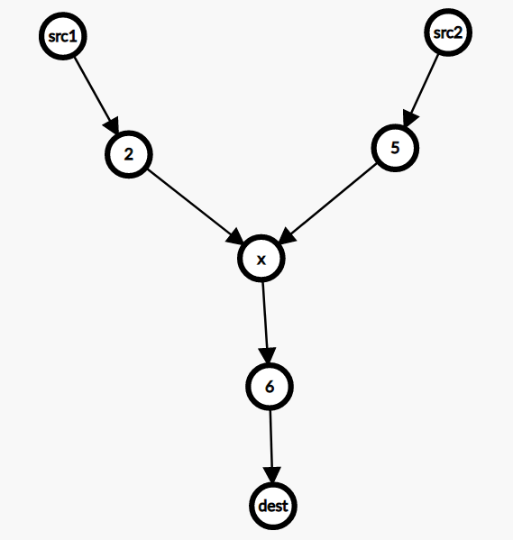

# 图论

## Dijkstra算法

### 原理

- 用于求解带权图的**单源最短路径**问题
  - 即一点到图中任意一点的最短路径
- 过程：L(v)表示从原点s到v的最短路径，w(e)表示边的权
  - 初始化i=0，S={s}(已经遍历到的点)，L(s)=0,其他点L(v)=无穷大
  - 对于所有不在S中的点（未找到最短路径）vϵV~G~-S，L(v)=min{L(v),min uϵs{L(u)+W(u,v)}}更新
  - 找到新的具有最小L(v)的v，将其加入S
  - 直至做有点都加入S终止
- 模板

~~~c++
 vector<int> dijkstra(vector<vector<pair<int, int>>> &g, int start) {//图存储pair<目标点，权值>
        vector<int> dist(g.size(), INT_MAX);//初始化
        dist[start] = 0;//出发点
        priority_queue<pair<int, int>, vector<pair<int, int>>, greater<>> pq;//将距离与点组队，方便优先队列排序
        pq.emplace(0, start);
        while (!pq.empty()) {
            auto[d, x] = pq.top();
            pq.pop();
            if (d > dist[x]) continue;//剪枝，说明在这之后距离更小的组合被添加进入了队列，由于优先队列的性质，更小的会优先出队，也就意味这个点已经更新过了。可以直接跳过
            for (auto[y, wt] : g[x]) {//更新
                int new_d = dist[x] + wt;//从x间接到达y的距离
                if (new_d < dist[y]) {
                    dist[y] = new_d;
                    pq.emplace(new_d, y);//被更新的点都是候选点，优先队列会去选择最小的
                }
            }
        }
        return dist;
    }
~~~


### 例题

- [882. 细分图中的可到达节点](https://leetcode.cn/problems/reachable-nodes-in-subdivided-graph/)

- 自定义权值
  - [1631. 最小体力消耗路径 ](https://leetcode.cn/problems/path-with-minimum-effort/)
  - [778. 水位上升的泳池中游泳](https://leetcode.cn/problems/swim-in-rising-water/)

- [1976. 到达目的地的方案数 ](https://leetcode.cn/problems/number-of-ways-to-arrive-at-destination/submissions/)
  - 小心溢出，全要用long long，以及LONG_MAX
- [2203. 得到要求路径的最小带权子图](https://leetcode.cn/problems/minimum-weighted-subgraph-with-the-required-paths/)
  - 
  - 两个点到一个点的路径生成的子图权值和的最小值
  - 我们可以枚举三岔口的交点 x*x*，然后求 src1和 src2 到 x的最短路，以及 x 到 dest 的最短路，这可以通过在反图（即所有边反向后的图）上求从 dest出发的最短路得出。累加这三条最短路的和，即为三岔口在 x 处的子图的边权和。枚举所有 x，最小的子图的边权和即为答案。

```c++
long long minimumWeight(int n, vector<vector<int>> &edges, int src1, int src2, int dest) {
        vector<vector<pair<int, int>>> g(n), rg(n);
        for (auto &e: edges) {
            int x = e[0], y = e[1], wt = e[2];
            g[x].emplace_back(y, wt);
            rg[y].emplace_back(x, wt);
        }

        auto d1 = dijkstra(g, src1);
        auto d2 = dijkstra(g, src2);
        auto d3 = dijkstra(rg, dest);

        long ans = LONG_MAX / 3;//dijkstra中用LONG_MAX/3初始化,意味着找不到路径
        for (int x = 0; x < n; ++x)//枚举x
            ans = min(ans, d1[x] + d2[x] + d3[x]);
        return ans < LONG_MAX / 3 ? ans : -1;
    }
```

