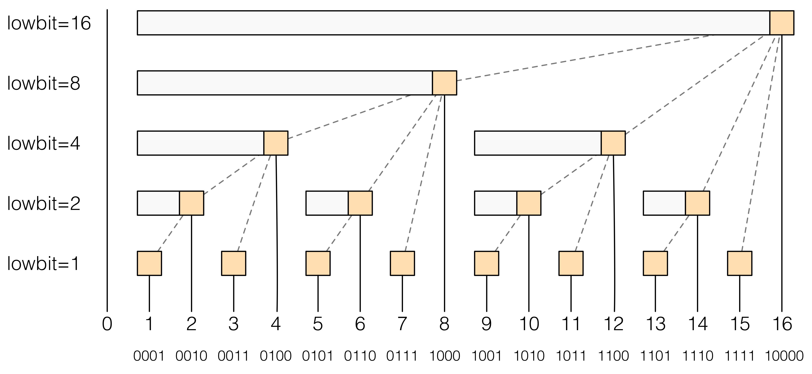
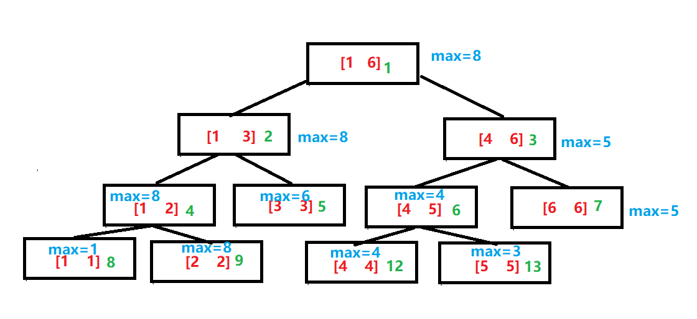
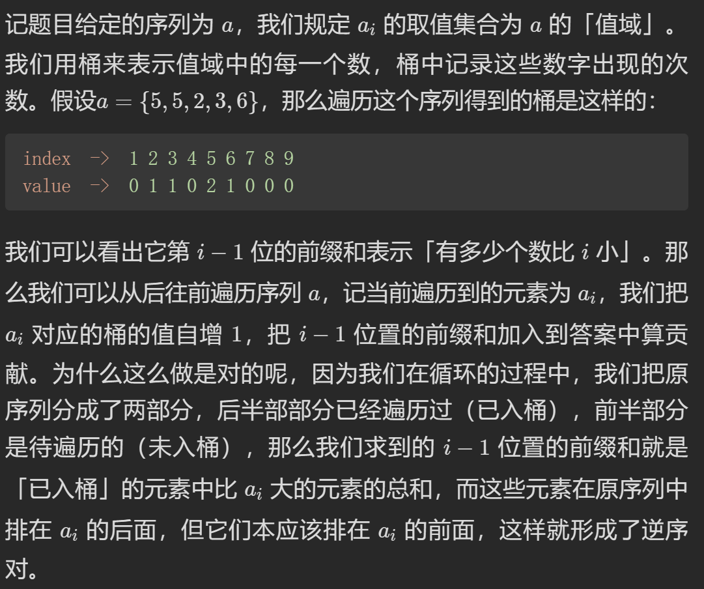
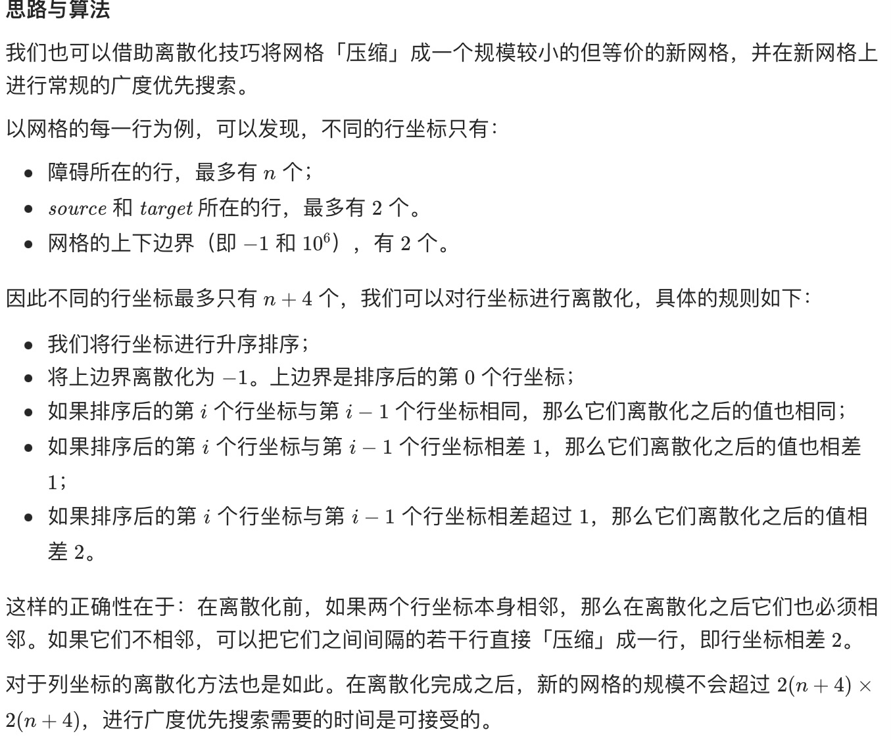
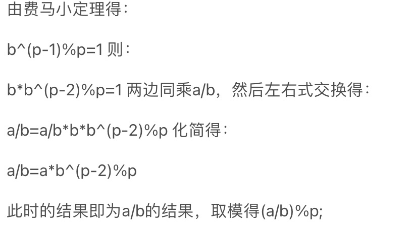

# 数据结构
## 树状数组

- [树状数组详解](https://www.cnblogs.com/xenny/p/9739600.html)

- 动态（元素可变）求解前（后）缀问题
- 操作复杂度`log(n)`
- 数组大小n
- 

- lowbit函数
  - x&-x：获取x最后一个1所代表的大小
  - 如1010返回2，1100返回4
- C[i] = A[i - 2^k^+1] + A[i - 2^k^+2] + ... + A[i];  //k为i的二进制中从最低位到高位连续零的长度
  - 2^k^=lowbit
- SUM~i~ = C[i] + C[i-2^k1^] + C[(i - 2^k^1) - 2^k2^] + .....；
- 初始化：
  - 初始化树状数组全部元素为零
  - 对每一位逐个按照原数组的值update


### 模板

```c++
int n;
int a[1005],c[1005]; //对应原数组和树状数组(树状数组大小与原数组一致，要求下标从1开始)
int lowbit(int x){
    return x&(-x);
}
void updata(int i,int k){    //在i位置加上k（是变化量）
    while(i <= n){
        c[i] += k;
        i += lowbit(i);
    }
}
int getsum(int i){        //求A[1 - i]的和
    int res = 0;
    while(i > 0){
        res += c[i];
        i -= lowbit(i);
    }
    return res;
}
```


## 线段树

- [线段树详解](https://www.cnblogs.com/xenny/p/9801703.html)

- 动态求解**区间问题**，比树状数组更为强大
- 操作复杂度`log(n)`
- 数组大小4n
- 

- l = fa*2 （左子树下标为父亲下标的两倍）
- r = fa*2+1（右子树下标为父亲下标的两倍+1）
  - 要求下标从1开始
- 下标从0开始则为fa\*2+1和fa\*2+2

### 模板

- 以区间内最大值为例

```c++
const int maxn = 100005;
int a[maxn](仅用于build函数，有时可以省略),t[maxn<<2];        //a为原来区间，t为线段树

void Pushup(int k){        //更新函数，这里是实现最大值 ，同理可以变成，最小值，区间和等
    t[k] = max(t[k<<1],t[k<<1|1]);
}

//递归方式建树 build(1,1,n);
void build(int k,int l,int r){    //k为当前需要建立的结点，l为当前需要建立区间的左端点，r则为右端点
    if(l == r)    //左端点等于右端点，即为叶子节点，直接赋值即可
        t[k] = a[l];
    else{
        int m = l + ((r-l)>>1);    //m则为中间点，左儿子的结点区间为[l,m],右儿子的结点区间为[m+1,r]
        build(k<<1,l,m);    //递归构造左儿子结点
        build(k<<1|1,m+1,r);    //递归构造右儿子结点
        Pushup(k);    //更新父节点
    }
}

//点更新
//递归方式更新 updata(p,v,1,n,1);
void updata(int p,int v,int l,int r,int k){    //p为下标，v为要加上的值，l，r为结点区间，k为结点下标
    if(l == r)    //左端点等于右端点，即为叶子结点，直接加上v即可
        a[k] += v,t[k] += v;    //原数组和线段树数组都得到更新（v是变化值）
    else{
        int m = l + ((r-l)>>1);    //m则为中间点，左儿子的结点区间为[l,m],右儿子的结点区间为[m+1,r]
        if(p <= m)    //如果需要更新的结点在左子树区间
            updata(p,v,l,m,k<<1);
        else    //如果需要更新的结点在右子树区间
            updata(p,v,m+1,r,k<<1|1);
        Pushup(k);    //更新父节点的值
    }
}

//递归方式区间查询 query(L,R,1,n,1);
int query(int L,int R,int l,int r,int k){    //[L,R]即为要查询的区间，l，r为结点区间，k为结点下标
    if(L <= l && r <= R)    //如果当前结点的区间真包含于要查询的区间内，则返回结点信息且不需要往下递归
        return t[k];
    else{
        int res = -INF;    //返回值变量，根据具体线段树查询的什么而自定义
        int m = l + ((r-l)>>1);    //m则为中间点，左儿子的结点区间为[l,m],右儿子的结点区间为[m+1,r]
        if(L <= m)    //如果左子树和需要查询的区间交集非空
            res = max(res, query(L,R,l,m,k<<1));
        if(R > m)    //如果右子树和需要查询的区间交集非空，注意这里不是else if，因为查询区间可能同时和左右区间都有交集
            res = max(res, query(L,R,m+1,r,k<<1|1));

        return res;    //返回当前结点得到的信息
    }
}
```

- 补充区间更新

```c++
void Pushdown(int k){    //更新子树的lazy值，这里是RMQ的函数，要实现区间和等则需要修改函数内容
    if(lazy[k]){    //如果有lazy标记
        lazy[k<<1] += lazy[k];    //更新左子树的lazy值
        lazy[k<<1|1] += lazy[k];    //更新右子树的lazy值
        t[k<<1] += lazy[k];        //左子树的最值加上lazy值
        t[k<<1|1] += lazy[k];    //右子树的最值加上lazy值
        lazy[k] = 0;    //lazy值归0
    }
}

//递归更新区间 updata(L,R,v,1,n,1);
void updata(int L,int R,int v,int l,int r,int k){    //[L,R]即为要更新的区间，l，r为结点区间，k为结点下标
    if(L <= l && r <= R){    //如果当前结点的区间真包含于要更新的区间内
        lazy[k] += v;    //懒惰标记
        t[k] += v;    //最大值加上v之后，此区间的最大值也肯定是加v
    }
    else{
        Pushdown(k);    //重难点，查询lazy标记，更新子树
        int m = l + ((r-l)>>1);
        if(L <= m)    //如果左子树和需要更新的区间交集非空
            update(L,R,v,l,m,k<<1);
        if(m < R)    //如果右子树和需要更新的区间交集非空
            update(L,R,v,m+1,r,k<<1|1);
        Pushup(k);    //更新父节点
    }
}

//区间查询也需要修改
//递归方式区间查询 query(L,R,1,n,1);
int query(int L,int R,int l,int r,int k){    //[L,R]即为要查询的区间，l，r为结点区间，k为结点下标
    if(L <= l && r <= R)    //如果当前结点的区间真包含于要查询的区间内，则返回结点信息且不需要往下递归
        return t[k];
    else{
        Pushdown(k);    /**每次都需要更新子树的Lazy标记*/
        int res = -INF;    //返回值变量，根据具体线段树查询的什么而自定义
        int mid = l + ((r-l)>>1);    //m则为中间点，左儿子的结点区间为[l,m],右儿子的结点区间为[m+1,r]
        if(L <= m)    //如果左子树和需要查询的区间交集非空
            res = max(res, query(L,R,l,m,k<<1));
        if(R > m)    //如果右子树和需要查询的区间交集非空，注意这里不是else if，因为查询区间可能同时和左右区间都有交集
            res = max(res, query(L,R,m+1,r,k<<1|1));

        return res;    //返回当前结点得到的信息
    }
}
```


## 例题

- [307. 区域和检索 - 数组可修改 ](https://leetcode.cn/problems/range-sum-query-mutable/submissions/)

- [308. 二维区域和检索 - 可变](https://leetcode.cn/problems/range-sum-query-2d-mutable/)

  - 二维转化为一维

- [剑指 Offer 51. 数组中的逆序对](https://leetcode.cn/problems/shu-zu-zhong-de-ni-xu-dui-lcof/)

  - 典：离散化树状数组，统计一个数组中每一个元素前面或后面**更大（更小）**元素的数目

    - 即查询动态数组内特点范围内的整数数目

  - 

  - [题解](https://leetcode.cn/problems/shu-zu-zhong-de-ni-xu-dui-lcof/solution/shu-zu-zhong-de-ni-xu-dui-by-leetcode-solution/)

  - ```c++
    class BIT {
    private:
        vector<int> tree;
        int n;
    
    public:
        BIT(int _n): n(_n), tree(_n + 1) {}
    
        static int lowbit(int x) {
            return x & (-x);
        }
    
        int query(int x) {
            int ret = 0;
            while (x) {
                ret += tree[x];
                x -= lowbit(x);
            }
            return ret;
        }
    
        void update(int x) {
            while (x <= n) {
                ++tree[x];//出现次数加一
                x += lowbit(x);
            }
        }
    };
    
    class Solution {
    public:
        int reversePairs(vector<int>& nums) {
            int n = nums.size();
            vector<int> tmp = nums;
            // 离散化（利用排序后的次序）
            sort(tmp.begin(), tmp.end());
            for (int& num: nums) {
                num = lower_bound(tmp.begin(), tmp.end(), num) - tmp.begin() + 1;//从1开始
            }
            // 树状数组统计逆序对
            BIT bit(n);
            int ans = 0;
            for (int i = n - 1; i >= 0; --i) {
                ans += bit.query(nums[i] - 1);//统计前缀和
                bit.update(nums[i]);
            }
            return ans;
        }
    };
    ```

  - （类）[1395. 统计作战单位数](https://leetcode.cn/problems/count-number-of-teams/submissions/)

    - 寻找前面更小元素与后面更小元素

  - [2250. 统计包含每个点的矩形数目 ](https://leetcode.cn/problems/count-number-of-rectangles-containing-each-point/)

    - 二维(x,y)<(\_x,\_y)，对一维排序，另一维度使用树状数组处理

  - [327. 区间和的个数 ](https://leetcode.cn/problems/count-of-range-sum/)

    - 把要查找的元素也插入到set中，用set排序生成映射实现离散化

    - ```c++
      class Solution {
      public:
          int countRangeSum(vector<int>& nums, int lower, int upper) {
              long long sum = 0;
              vector<long long> preSum = {0};//前缀和
              for (int v: nums) {
                  sum += v;
                  preSum.push_back(sum);
              }
              
              set<long long> allNumbers;
              for (long long x: preSum) {//妙
                  allNumbers.insert(x);
                  allNumbers.insert(x - lower);
                  allNumbers.insert(x - upper);
              }
              // 利用哈希表进行离散化
              unordered_map<long long, int> values;
              int idx = 0;
              for (long long x: allNumbers) {
                  values[x] = idx;
                  idx++;
              }
      
              int ret = 0;
              BIT bit(values.size());
              for (int i = 0; i < preSum.size(); i++) {
                  int left = values[preSum[i] - upper], right = values[preSum[i] - lower];
                  ret += bit.query(right + 1) - bit.query(left);
                  bit.update(values[preSum[i]] + 1);
              }
              return ret;
          }
      };
      ```

- [1756. 设计最近使用（MRU）队列](https://leetcode.cn/problems/design-most-recently-used-queue/)

## 字典树（前缀树）

### 思想

- 前缀树 是一种树形数据结构，用于高效地存储和检索字符串数据集中的键。这一数据结构有相当多的应用情景，例如自动补完和拼写检查。
- 可以实现快速查找元素是否存在，是否存在以元素为前缀的元素
- 数据结构：
  - 多叉树（如只有小写字母则为26叉）
  - 每个节点包含子节点指针以及一个bool值表示是否存在以该节点结尾的单词

```c++
class Trie {
public:
    Trie() {
        root=new TreeNode;
    }
    
    void insert(string word) {
        TreeNode*p=root;
        for(auto a:word)
        {
            if(p->child[a-'a']==nullptr)
                p->child[a-'a']=new TreeNode;
            p=p->child[a-'a'];
        }
        p->check=true;//标记结尾
    }
    
    bool search(string word) {
        TreeNode*p=root;
        for(auto a:word)
        {
            if(p->child[a-'a']==nullptr)
                return false;
            p=p->child[a-'a'];
        }
        return p->check;//查找单词要求必须是结尾
    }
    
    bool startsWith(string prefix) {
        TreeNode*p=root;
        for(auto a:prefix)
        {
            if(p->child[a-'a']==nullptr)
                return false;
            p=p->child[a-'a'];
        }
        return true;//查找前缀不要求结束节点一定可以作为结尾
    }
private:
    struct TreeNode{
        TreeNode(){
            for(auto &a:child)
                a=nullptr;
            check=false;
        }
        TreeNode*child[26];//也可以使用hash存储
        bool check;
    };
    TreeNode* root;
};
```


### 例题

- [208. 实现 Trie (前缀树) ](https://leetcode.cn/problems/implement-trie-prefix-tree/)

- [1803. 统计异或值在范围内的数对有多少（难）](https://leetcode.cn/problems/count-pairs-with-xor-in-a-range/)
  - [c++字典树题解](https://leetcode.cn/problems/count-pairs-with-xor-in-a-range/solution/czidi-by-thdlrt-t0fc/)
- [212. 单词搜索 II ](https://leetcode.cn/problems/word-search-ii/)

# 算法
## 摩尔投票法
- vote初始值为0，当vote为零时，选定当前元素为临时众数，vote+1，遇到其他数vote-1。循环进行，最后的临时众数就是答案。
- [剑指 Offer 39. 数组中出现次数超过一半的数字](https://leetcode.cn/problems/shu-zu-zhong-chu-xian-ci-shu-chao-guo-yi-ban-de-shu-zi-lcof/)
    - （找众数）

##  Manacher

- 寻找最长回文串的

## KMP
### 思想
- [KMP算法讲解](https://b23.tv/tzuL0dq)
- next数组：next[i]表示在[0，i]最大相同前缀与后缀的长度
    - 如：**as**dsd**as**为2；**asd**s**asd**为3；
### 模板
```c++
vector<int> build_next(string&s)//构建next数组
{
    vector<int>next{0};//第一位一定为零（因为规定前后缀不能为自身）
    int i=1,len=0;//len记录当前位置最大重合长度
    while(i<s.size())
    {
        if(s[len]==s[i])
        {
            len++;
            next.push_back(len);
            i++;
        }
        else
        {
            if(len==0)
            {
                next.push_back(0);
                i++;
            }
            else
                len=next[len-1];//找到对应的前缀的末尾位置（一种递归思想，长的匹配不上则逐渐缩短去找）
        }
    }
    return next;
}
    int kmp(string fs,string ss)//ss为待匹配的子串
    {
        vector<int>next=build_next(fs);
        int i=0,j=0;
        while(i<fs.size())
        {
            if(fs[i]==ss[j])
            {
                i++;
                j++;
            }
            else if(j>0)
                j=next[j-1];前next[j-1]位仍相同，在这之后继续匹配
            else
                i++;
            if(j==ss.size())
                return i-j;
        }
        return -1;
    }
```
### 例题
- [1392. 最长快乐前缀](https://leetcode.cn/problems/longest-happy-prefix/)
    - 应用next数组构建的思想
## 离散化处理
### 思想
- 把无限空间中的有限的个体映射到有限的空间中，提高时空效率（不该边数据相对关系的前提下对数据进行缩小，处理比较稀疏的数据），可以看作是一种哈希
    - 如[100,200],[20,100000]->[2,3],[1,4]
    - 如把一组数据转化为排序后与之相对应的下标
- 只关心数据之间的（大小）关系，不关心数据具体的值
### 例题
- [（难）1036. 逃离大迷宫](https://leetcode.cn/problems/escape-a-large-maze/)
    - 离散化处理加速bfs（因为大部分为空格，可以进行合并）
    
```c++
class Solution {
private:
    static constexpr int BOUNDARY = 1000000;
    static constexpr int dirs[4][2] = {{0, 1}, {0, -1}, {1, 0}, {-1, 0}};
    
public:
    bool isEscapePossible(vector<vector<int>>& blocked, vector<int>& source, vector<int>& target) {
        if (blocked.size() < 2) {
            return true;
        }
        vector<int> rows, columns;//统计全部xy坐标
        for (const auto& pos: blocked) {
            rows.push_back(pos[0]);
            columns.push_back(pos[1]);
        }
        rows.push_back(source[0]);
        rows.push_back(target[0]);
        columns.push_back(source[1]);
        columns.push_back(target[1]);
        
        // 离散化
        sort(rows.begin(), rows.end());
        sort(columns.begin(), columns.end());
        rows.erase(unique(rows.begin(), rows.end()), rows.end());//去重
        columns.erase(unique(columns.begin(), columns.end()), columns.end());
        unordered_map<int, int> r_mapping, c_mapping;//哈希映射（离散化）（xy分别进行映射）

        int r_id = (rows[0] == 0 ? 0 : 1);//若原坐标不为0则要增加一个空行（列）
        r_mapping[rows[0]] = r_id;
        for (int i = 1; i < rows.size(); ++i) {
            r_id += (rows[i] == rows[i - 1] + 1 ? 1 : 2);
            r_mapping[rows[i]] = r_id;
        }
        if (rows.back() != BOUNDARY - 1) {//末尾增加空行（列）
            ++r_id;
        }

        int c_id = (columns[0] == 0 ? 0 : 1);
        c_mapping[columns[0]] = c_id;
        for (int i = 1; i < columns.size(); ++i) {
            c_id += (columns[i] == columns[i - 1] + 1 ? 1 : 2);
            c_mapping[columns[i]] = c_id;
        }
        if (columns.back() != BOUNDARY - 1) {
            ++c_id;
        }

        vector<vector<int>> grid(r_id + 1, vector<int>(c_id + 1));//压缩图
        for (const auto& pos: blocked) {
            int x = pos[0], y = pos[1];
            grid[r_mapping[x]][c_mapping[y]] = 1;
        }//障碍新坐标
        
        int sx = r_mapping[source[0]], sy = c_mapping[source[1]];
        int tx = r_mapping[target[0]], ty = c_mapping[target[1]];

        queue<pair<int, int>> q;//新目标点/起点
        q.emplace(sx, sy);
        grid[sx][sy] = 1;
        while (!q.empty()) {//bfs
            auto [x, y] = q.front();
            q.pop();
            for (int d = 0; d < 4; ++d) {
                int nx = x + dirs[d][0], ny = y + dirs[d][1];
                if (nx >= 0 && nx <= r_id && ny >= 0 && ny <= c_id && grid[nx][ny] != 1) {
                    if (nx == tx && ny == ty) {
                        return true;
                    }
                    q.emplace(nx, ny);
                    grid[nx][ny] = 1;
                }
            }
        }
        return false;
    }
};
```
## 除法逆元
### 思想
- 由于除法本身不支持取模运算，因此需要转化为乘法来计算

- 由于需要计算b的幂，可以用含取模的快速幂实现
```c++
long long quick_pow(int a,int b)
{
    long long ans=1;
    while(b){
        if(b&1) ans=(ans*a)%mod;
        b>>=1;
        a=(a*a)%mod;
    }
    return ans;
}
//逆元函数 公式为 (a/b)%mod=(a*b^(mod-2))%mod
long long inv(int a,int b)
{
    return (a*quick_pow(b,mod-2))%mod;
}
```
### 例题
- [6276. 统计同位异构字符串数目](https://leetcode.cn/problems/count-anagrams/)
    - 阶层除法防溢出