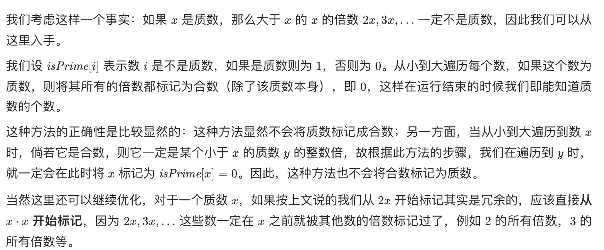
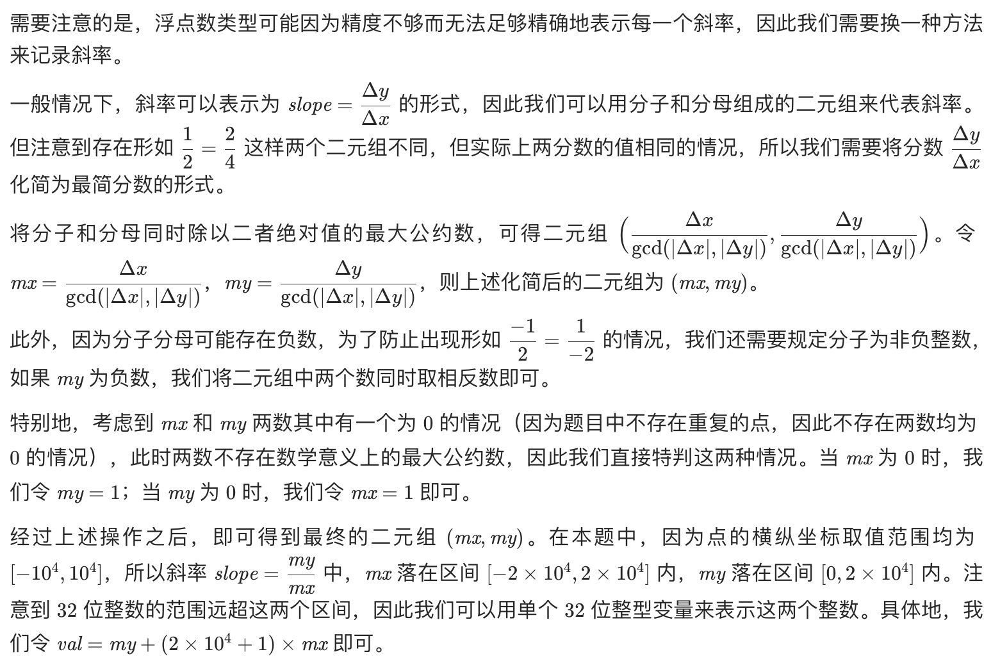

[TOC]

# 数学

## 知识点
### 质数
- 判定
    - 如果一个数n是合数，那么一定存在xy=n且x<=sqrt(n)<=y，即一定有被1<=x<=sqrt(n),可以被n整除，因此判断一个数是否存在x即可（范围为sqrt(n)）
    - 进一步优化：埃氏筛


```
class Solution {
public:
    int countPrimes(int n) {
        vector<int> isPrime(n, 1);
        int ans = 0;
        for (int i = 2; i < n; ++i) {
            if (isPrime[i]) {
                ans += 1;
                if ((long long)i * i < n) {
                    for (int j = i * i; j < n; j += i) {
                        isPrime[j] = 0;
                    }
                }
            }
        }
        return ans;
    }
};
```
- 裴蜀定理：ax+by一定是gcd（x,y)的倍数，若存在ax+by=0则互质
## 库函数

- gcd(a,b)最大公因数	lcm(a,b)最小公倍数

## 例题

- [878. 第 N 个神奇数字](https://leetcode.cn/problems/nth-magical-number/)
  - lcm拆分|容斥原理
  
- 质因数的个数

  - 求正整数N(N>1)的质因数的个数。 相同的质因数需要重复计算。如120=2\*2\*2\*3\*5，共有5个质因数。//如果不是重复计数，那就是求质因数的种类

  - ```c++
    #include<iostream>
    #include<cmath>
    using namespace std;
    int main(){
        int n;
        int ans=0;
        while(cin>>n){
            ans=0;
            for(int i=2;i<=sqrt(n);i++){
                while(n%i==0){
                    n=n/i;//事实上这里的i一定是质数，如果不是质数那么一定可以分解成更小的质数，在这之前就已经被除去了，因此这里除的一定是质数
                    ans++;
                }
            }
            if(n>1){
                ans++;//比n的平方根大的质因数最多只能有一个（n>1就说明有）
            }
        cout<<ans<<endl;
        }
    }
    ```
- [1250. 检查「好数组」](https://leetcode.cn/problems/check-if-it-is-a-good-array/solution/)
- [149. 直线上最多的点数](https://leetcode.cn/problems/max-points-on-a-line/)
    - 由于浮点数会损失精度，因此要寻找其他方法表示斜率
    

- [剑指 Offer 44. 数字序列中某一位的数字](https://leetcode.cn/problems/shu-zi-xu-lie-zhong-mou-yi-wei-de-shu-zi-lcof/solution/shu-zi-xu-lie-zhong-mou-yi-wei-de-shu-zi-mqw7/)
- [264. 丑数 II](https://leetcode.cn/problems/ugly-number-ii/)
- [1739. 放置盒子](https://leetcode.cn/problems/building-boxes/)
    - 数学找规律
