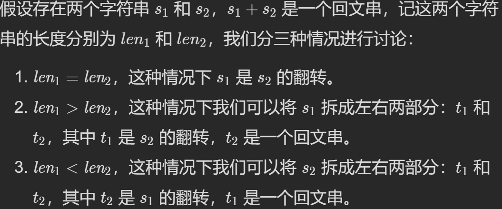

# 数组
## 双指针滑动窗口
### 例题
- [经典问题](https://leetcode.cn/problems/subarrays-with-k-different-integers/solution/k-ge-bu-tong-zheng-shu-de-zi-shu-zu-by-l-ud34/)
- [42. 接雨水](https://leetcode.cn/problems/trapping-rain-water/)
  - 多方法：动态规划，单调栈，
## 特殊
- [剑指 Offer 66. 构建乘积数组](https://leetcode.cn/problems/gou-jian-cheng-ji-shu-zu-lcof/)
    - 前缀积*后缀积，避免除法
    - 三角遍历可以避免用额外空间存储前后缀

# 字符串
## 特殊
- [面试题45. 把数组排成最小的数](https://leetcode.cn/problems/ba-shu-zu-pai-cheng-zui-xiao-de-shu-lcof/)
- [1754. 构造字典序最大的合并字符串](https://leetcode.cn/problems/largest-merge-of-two-strings/)
- [336. 回文对](https://leetcode.cn/problems/palindrome-pairs/)
  - 拼接回文串思路
  - 