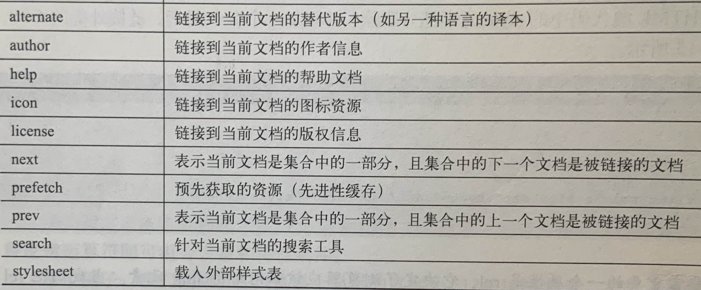
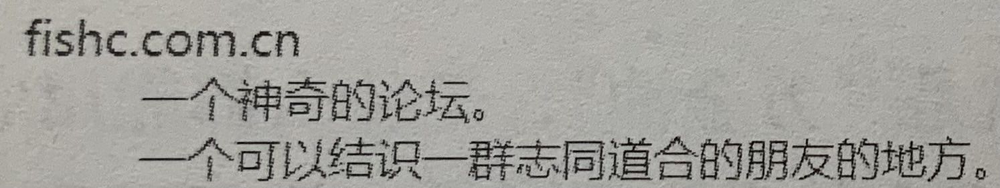
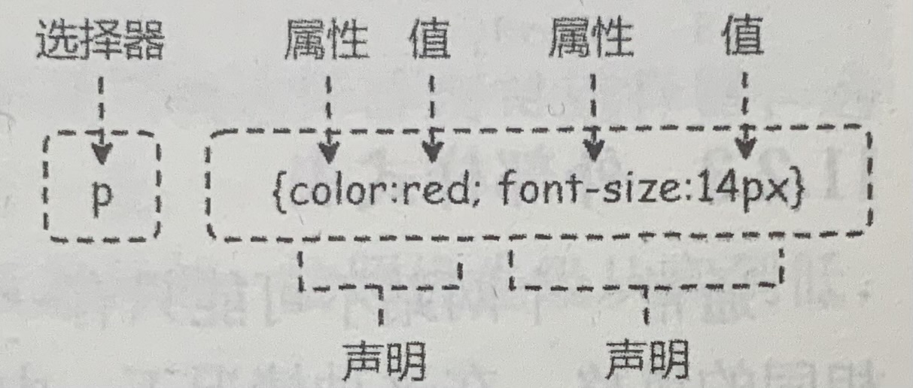

# html
## 基本语法
### 主体框架
```html
<!QOCTYPE html>//声明表示该文档由html5编写
<html>//文档开始
<head>//头部起点，头部元素容器，可以引用脚本、指示浏览器找到样式表、提供源信息
	<title>第一个程序</title>//文档标题
</head>//头部结束
<body>//主体起点，包含文档内容（文本、图像、超链接等）
	<h1>Hello</h1>
	<p>I love FishC!</p>
</body>//主体结束
</html>//文档结束——
```
### 元素
- `<h1>~<h6>`：不同字号的标题
    - `<h1>text</h1>`
- `<p>`：定义段落（自动在前后创建空白）
    - `<p>text</p>`
- `<span>`：选择区间（可以用于包住一段内容，本身没有任何含义）
- ``：插入图片
    - ``
        - src：图片路径(其他参数均可以省缺)
        - alt：图片无法显示时的替代文本
- `<a>`：插入超链接
    - `<a href="https://...">显示的名称</a>`
    - 除了href还有target属性
        - _blank：在新窗口中打开
        - _parent：在父窗口中打开，不存在则在当前窗口打开
        - _self：当前窗口打开（默认）
        - _top：在整个窗口打开
        - framename：指定框架打开
- `<meta>`：设置
    - 写在head里
    - `<meta char set="utf-8">`指定浏览器用utf-8显示文字
        - 源文件中保存为utf-8编码，再用utf-8打开，避免乱码
    - `<meta name="viewport" content=”width=device-width,initial-scal=1.0“>`自适应窗口缩放
    - 描述网站：搜索引擎优化
        - 关键词：`<meta name="keywords" content="">`
        - 描述：`<meta name="description" content="">`
        - 作者：`<meta name="author" content="">`
    - 网页跳转：倒计时跳转网页
        - `<meta http-equiv="refresh" content=5; https://...>`
            - content表示秒数
- `<style>`：定制样式（css样式）
    - 可以实现修改颜色、样式、添加背景等功能
    - 属性：
        - media：指定样式适用的媒体（如打印模式，投影仪模式，以及特定约束条件）
            - `media="print"`打印时的性质
            - `media="screen and (min-width:512px) and (max-with:1024px)"`窗口用于计算机模式且宽度处于一定范围时的性质
        - scoped：作用范围（一般不使用）
        - type：样式类型（默认为css也只有这一种）
    - ```
      <style type="text/css" media="">//参数可省略
      p{
        color: white;//把段落颜色改为白色
      }
      </style>
      ```
- `<link>`链接外部样式表（属性）
    - 可以将style内的内容单独作为一个css文件链接进来
    - `<link rel="" type="text/css" media="" href=""`
        - media与style相同
        - href为链接文件的地址
        
- `<base>`基准位置 
    - 补充
        - ./从当前目录开始
        - ../从上一级目录开始
        - /从根目录开始
    -  只会影响相对路径而不会影响绝对路径
    -  与超链接语法类似：`<base href="基准位置.../" target="打开方式">`
- `<script>`定义/引用脚本（配合js使用）
    - 内嵌脚本：`<script type="text/javascript">脚本</script>`
    - 引用外部脚本：`<script type="text/javascript" src="js文件链接"></script>`
    - 执行
        - 正常情况下html解析是单线操作的，遇到js脚本就会暂停文档解析，转而获取并执行js脚本，完成后回到文档解析。（即执行先后与script位置有关系）
        - 延迟执行：（全部解析完再执行脚本）`<script... defer>`添加defer属性
        - 异步执行：（解析与脚本执行同时进行）添加async属性，只对引用脚本起作用
    - `<noscript>...</noscript>`浏览器不支持js时显示的内容
### 标记文字的元素
- 用正确元素做正确的事，从而实现语义化，功能相同，只是更好理解（考虑抓取源代码的爬虫）
- 注释
    - html：`<!-- 注释 -->`
    - css：`/**/`
- 块级元素和行内元素
    - 块级：在新的行上开始，尽可能占据本行全部可用空间
    - 行内：不另起一行，只占用必要的宽度
    - 正常情况下（如适用h1，p）文字之间的多个空白字符（如空格和会车）会被视为一个空格
- `<br>`换行
- `<pre>`
    - 用pre元素包住会保留文本中的空白、制表符、换行符
    - 有些保留字符不能直接输出，需要使用其实体编号。
        - `“`：&#34
        - `‘`：&#39
        - `&`：&#38
        - `<`：&#60
        - `>`：&#62
- `<code>`
    - 在pre内再使用code，来呈现源代码
- `<var>`：程序变量
- `<kbd>`：用户输入
- `<samp>`：程序输出
- `<q>`：引用，会自动加双引号
- `<blokquote>`：引用多行（可以在里面嵌套<p>），会自动添加缩进
    - 对于具体的效果应该由css来
- `<cite>`：定义作品（如书籍、电影等）的标题
- `<abbr title="">...</abbr>`：定义简称或缩写（可以用title指定全称，鼠标移动到上面时会自动显示）
- `<dfn>`：突出术语
- `<address>...</address>`：定义文档或文章作者及其联系信息
- `<ruby>字<rp>(</rp><rt>拼音</rt><rp>)</rp></ruby>`：注音
    - rt元素标记注音符号（在文字上面显示）
    - 如果浏览器不支持，则会直接显示rp内的和rt内的内容（会在文字后面显示）
- `<bdo dir="rtl">...</bdo>`：从右向左颠倒显示
- 加粗
    - `<strong>`：突出重要文本
    - `<b>`：无语义
- 斜体
    - `<em>`：强调
    - `<i>`：无语义
- 删除线
    - `<del>`：表示删除
    - `<s>`：表示错误
- `<ins>`：下划线
- `<mark>`：高亮显示
- `<sub>`：以下标显示
    - sup上标显示
- `<small>`：缩小显示
### 结构
#### 列表
- 无序列表
    - ul表示无序列表，li表示项
    - ```
      <ul 属性>
            <li>...</li>
            <li>...</li>
            ...
      </ul>
      ```
- 有序列表
    - ol表示有序列表，li表示项
    - 属性：
        - reversed：反向编号
        - start：指定起始值
        - type：指定标记类型
- 定义列表
    - 可以多对多
    - ```
      <dl>
        <dt>//条目
        <dd>//描述
      </dl>
      ```
      
- 可以使用css定义标记样式：list-style-type选择标记，list-style-image自定义图片
- 列表可以嵌套
#### 表格
- 基本格式:
```
<table>
    <caption>标题</caption>//可选
    <tr>//表示行
        <th>表头</th>//表头单元格
        ...
    </tr>
    <tr>
        <td>内容</td>//数据单元格
        ...
    </tr>
    ...
</table>
```
- th td支持跨行、跨列显示
    - 使用关键词colspan rowspan实现
    - 如`<td rowspan="3">内容<..>`
- 边框（css）
    - 如`th{border: 1px solid black;}`(table,th,td分别设置)
    - 合并边框：增加`th{border-collapse: collapse;}`
- 行分割
    - 使用`thead tbody tfoot`把表格分为三部分
    - 从而使用`thead th`等实现更细致的操作
- 列分割
    - 使用colgroup和col
    - ```
      <colgroup>
            <col style="">
            <col span="2" style...>
      </colgroup>
      ```
#### 表单
- 实现与用户的交互
```
    <form action="处理文件(如welcome.php)" method="post" target=“_blank”>//target表示新界面打开方式，与超链接类似
        题目：<input type="text" name="name"><br>//type表示变量类型，name表示名称
        ...
        <button type="submit">按钮名称</button>
    </form>     
```
- 提交方式有get和post
    - gey会将提交的数据整合到url中，post更常用
- button
    - type属性
        - submit：提交表单内容到服务器，交由脚本处理
        - reset：清空输入框内的内容
        - button：点击后没有效果
    - 用`formmrthod="get"`属性单独设置提交方式
- 自动填充（让浏览器记住用户的选择）
    - 可以直接在form中全局设置也可以单独对每一条设置
        - 添加属性`autocomplete="on"`或者off
- 绑定
    - 用label绑定后点击前面文字就会自动跳转到后面的输入框
        - `<label>题目：<...></label>`
        - `<label for="name">...<...id="name">`指定id值
- 分组：用方框划分表单
    - `<fieldset>...<fieldset>`包住
    - 对分区命名：在`<fieldset>`下添加`<legend>文字<legend>`
- 下拉列表（选项）
    - ```
      <label>题目：
      <select name="变量名">
        <option value="选项返回值">选项名称</option>//选项
        ...
      </select>
      </label>
      ```
    - 分组：`<optgroup label="标题">...</optgroup>` 
- `oupput`输出
    - 如`<output name="" for="a b"></...>`输出a和b的值
- `textarea`多行文本输入
    - `<textarea name="">段落</textarea>`
    - 尺寸：属性`row col`
    - wrap属性
        - soft：在页面渲染中对文字自动换行，提交的不换行
        - hard：提交的也换行
        - off：渲染不自动换行
- 其他属性（针对单独的一项）
    - 默认值：`value=”“`
    - 自动聚焦：表单加载完成后光标会自动聚焦到指定的input`autofocus`
    - 禁用元素：添加`disabled`(不会提交这一部分的内容)
    - 只读：`readonly`
#### input功能扩展（通过设置type属性实现不同功能）
- `reset button`和按钮的功能一致
- `radio`单选框
    - `<label><input type="radio" name="" value="">男</label>`
    - 多个单选框使用同一个变量名可以实现联动（选项互斥）
- `checkbox`复选框
    - 与单选框类似
- 输入时间日期
    - `tiem`：时间
    - `date`：日期
    - `month`：年月
    - `week`：星期
    - `date time-local`：本地日期和时间
- `search`搜索
- `color`颜色
- `image`图像作为按钮
    - `<input type="image" src="路径" alt="">`
    - 还会自动传递点击点的相对坐标
- `hiden`隐藏不显示
- `file`上传文件
    - 上传文件需要在enctype中指定模式
        - 默认为`application/x-www-form-urlencoded`
        - 应该设置为`multiparty/form-data`
    - 给input添加accept属性限制上传文件的类型
        - 直接输入文件后缀名如`.png`
        - MIME类型描述，如`image/*`限定所有图像文件
    - 限制文件的尺寸
        - 增加一个隐藏的input的元素设置最大大小
        - `input type="hidden" name="MAX_FILE_SIZE" value="大小（字节）"`
    - 增加属性multiple实现多文件上传
- 数字输入
    - `number`数字输入
        - 范围限定：添加属性`min max step`step表示调整幅度
    - `range`滚动条模式
        - `val min max step`val设置初始值
- 邮箱电话网址
    - `email tel url`默认匹配不一定符合需求可以使用正则表达式自定义
    - `<input type="email" name="" pattern="正则表达死">`
- `placeholder`
    - 在输入框中给予用户提示
    - 添加属性`placeholder=""`
- `required`要求必须填入
- `size`设置输入框长度
- `maxlength`限制输入字符的数目
- 列表选择
    - ```
      <input...list="id">
      ...
        <datalist id="">
        <option value="">...</option>
      ...
      </datalist>
    ```
### div和语义化布局
- 传统使用div对网页实现分区
    - 如`<div class="名称">内容</div>`
- 新标准凸显网页语义化（使用如`<nav>...</nav>`）
    - header：简介内容
    - nav：导航
    - main：主内容
    - artical：独立的文章内容（与页面其他部分）
    - section：文档中的节
    - aside：侧边栏
    - footer：页脚
    - details：额外细节
    - summary：定义details的标题（总结）
    - 可以嵌套使用，也可以带class关键字
### 嵌入元素
 - 图片
     - 可以实现点击图片不同区域实现分区跳转
         - 用map建立映射，用area定义映射区域以及对应跳转的url，再在img中使用对应的map
         - ```
           //必须要加个#
           <map name="book">
                <area shape="circle" cords="784,241,163" alt="" href="" target="">//或分区域并跳转到不同地址，shape可以选择circle，poly(多边形)，rect(矩形)；coords设置区域的大小
           ```
        - 使用picture内嵌source，根据条件匹配不同的图片
            - ```
              <picture>
                <source media="min-width: 1024px" srcset="路径">//media设置条件
                ...
                //浏览器不支持picture时会直接显示img
              </picture>
              ```
        -  插图
            - ```
              <figure>
                
                <figcaption>插画标题</figcaption>
              </figure>
              ```
 - 视频
     - `<video width="" height="" src="">视频无法播放时显示的文字</video>`
     - 播放控件：controls
     - 自动播放：autoplay
     - 视频预加载：preload
         - auto：要求浏览器尽快加载整个视频
         - metadata：只加载视频的元数据
         - none：不加载
    - 视频封面：`poster="封面地址"`
    - 不同条件下播放不同视频
        - 在video内包住多个source
    - 字幕
        - 常用vtt格式文件
            - ```
              00:00:09.250 --> 00:00:11.170//显示的时间区间
              字幕内容
              ...
              ```
        - 使用时在video内增加track
            - `<video><track src="...vtt" srclang="ch(语言)" label="中文字幕" kind="subtitles" default(设置为默认)>...</video>`
- 音频
    - `<audio src="" control>`
- 网页
    - `<iframe src="" width="" height="">不支持iframe时显示的内容</iframe>`
    - sandbox属性：限制内嵌网页的权限
- 进度条类型
    - meter：min：最小值 max：最大值 low：较小的值 high：较大的值 optimum：最佳的值 value：默认值；在不同范围显示样式不同
        - `<meter id="" min=""...></meter>`
    - progress：仅有max和value
# css
## 如何使用

- 内联样式
    - html元素都有一个style属性，可以直接对其进行赋值
    - `<p style="color red;">`
- 内部样式表
    - 用style在头部定义
- 外部样式表
    - 用link引入
- 优先级：内联>内部>外部
## 选择器
### 基本选择器
- 通用选择器：`* {...}`多所有html元素操作
- 元素选择器：如`p{}`对一类元素操作
- 类选择器：对具有指定class属性的元素进行操作
    - `.xxx {}//前面一定要加.`
    - `<p class="xxx">`
    - 不同元素的calss属性可以相同
- id选择器：与class相比id属性是唯一的，只能指代单个元素
    - `#xxx {}//前面要加#`
### 复合选择器（由多个选择器复合）
- 交集选择器：
    - `元素选择器.类选择器`｜`元素选择器#id选择器`
- 并集选择器
    - `选择器1, 选择器2, 选择器3`
- 后代选择器
    - `选择器1 选择器2 选择器3`
    - 先匹配选择器1再从匹配元素的后代中找匹配选择器2的元素...
- 子元素选择器
    - `选择器1 > 选择器2`
    - 只匹配直接子元素
- 相邻兄弟选择器
    - `选择器1 + 选择器2`（选择器2才是真正的目标）
    - 匹配具有相同父元素，且紧跟在选择器1元素后面的选择器2元素
- 通用兄弟选择器
    - `选择器1 ～ 选择器2`
    - 不需要紧跟，具有相同父元素即可
### 伪元素选择器
- `::first-line`
    - 匹配所有文本块（块级元素）的第一行
    - `p::first-line`p元素的第一行
- `::first-letter`
    - 匹配文本块的第一个字符
- `::before`
    - 生成新内容插入到指定位置的前面/后面，使用content
    - 如`a::before {content: "..."}`
    - 也可以添加文本以外的内容如`content: url(...)`
- `::after`后面
- `::selection`
    - 对用户选中的文本的操作
### 伪类选择器
#### 动态伪类选择器
- 前四项常与超链接（a）联用
    - 可以实现不同状态时的不同样式
- `:link`
    - 未访问过链接
- `:visited`
    - 访问过链接
- `:hover`
    - 鼠标悬停在链接上方
    - 也常用于div元素
- `:active`
    - 单击链接
- `:focus`
    - 比如输入框被选中时
- tip：伪选择器可以在冒号前面加元素作为限定，前面也可以是复合选择器如`input#girl:focus` 
#### UI伪类选择器
- 可用|禁用
    - `:enabled `|`disabled`
- 选中
    - `:checked`
- 必填｜可选
    - `:required`|`:optional`
- 默认元素
    - `:default`
- 输入合法性
    - `valid`|`invalid`
- 是否在范围内（如number是否在min与max之间）
    - `in-range`|`out-of-range`
- 是否只读
    - `read-only`|`read-write`
#### 结构伪类选择器
- `:root`：匹配根元素
- `:empty`：匹配没有定义任何内容的元素（如`<p></p>`）
- `:first-child`：所有元素中的第一个子元素
    - `p:first-child`：匹配的是作为第一个子元素的p元素，而不是p元素中的第一个子元素
- `:last-child`：最后一个子元素
- `:only-child`：唯一子元素（即一个元素是其父元素的唯一子元素）
- `:nth-child`：第n个
    - 用括号传参数：`p:non-child(3){...}`
- `:nth-last-child`：逆向
- `child`替换为`of-type`：匹配父元素下唯一指定类型的子元素
    - 如`p:first-of-child`作为父元素下第一个p元素的元素
    - 
#### 其它伪类选择器
- `:target`：匹配锚点(在页面内跳转时执行)
    - 锚点指跳转点：`<p id=target1>text</p>`设置id
    - 用a实现跳转：`<a href="#target1">...</a>`#加id
- `:lang`：匹配设置了lang属性的元素
    - `:lang(zh){...}`需要参数
    - lang指语言，如`lang="zh"`
- `:not`：反向选择器
    - `:not()`可以对任意选择器实现反向匹配
#### 伪类选择器和伪元素选择器的区别
- 伪类选择器是为了已有元素处于某个状态时为其增加样式；伪元素选择器用于创建一些文档数中不存在的元素，并为其添加样式
### 属性选择器
- 针对属性名或属性值来进行匹配
- `[attr]`：匹配定义了attr属性的元素，不考虑值
- `[attr="val"]`：值为val
- `[attr^="val"]`：值以val开头
- `[attr$="val"]`：值以val结尾
- `[attr*="val"]`：值包含val字符串
- `[attr~="val"]`：值为val（可以有多个属性值，只要其中一个为val即可）
- `[attr|="val"]`：由连字符分割，且val位于前面（如：val-xxx）
## 样式属性