## 计算机系统概述

### 冯诺依曼计算机体系

- 基本思想：
  - 采用存储程序工作方法：将事先编好的程序和原始数据送入主存后才能执行程序，启动执行后，计算机能在不需要操作人员干预下自动完成逐条指令去除和执行的任务
  - 由运算器，控制器，存储器，输入输出设备会构成
  - 存储器存放数据和指令；控制器自动取出并执行指令；运算器进行算数逻辑运算；
  - 内部用二进制进行储存，每条指令由操作码和操作地址码组成，指出操作类型和操作数的地址
  - 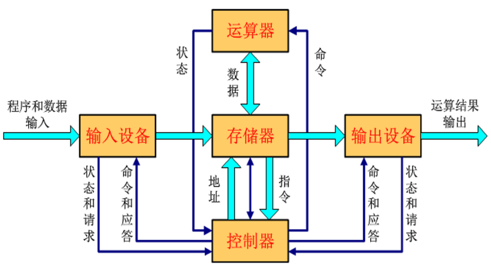
- 现代计算机基本结构：
  - 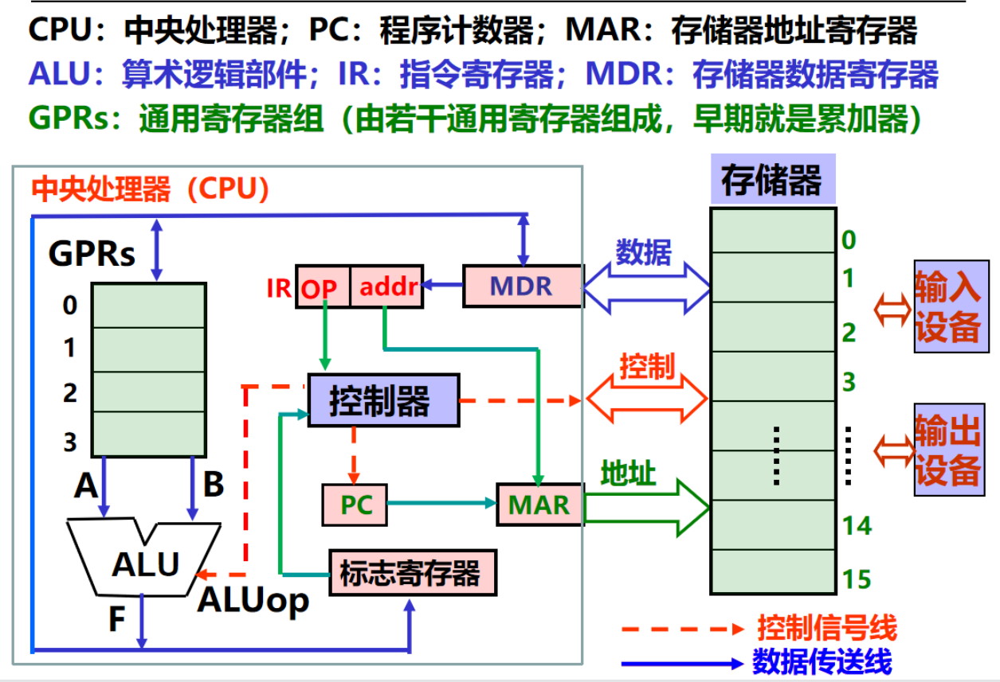
    - ALU的运算结果会产生标志信息，如零标志ZF，负标志SF等记录在标志寄存器中
    - 从主存获取的指令存储在指令计数器IR，数据在GPRs
    - 程序计数器PC用于实现自动按序读取主存中的指令，计算机会自动计算下一条指令的地址并送到PC中保存（开始时取指令）
    - 总线连接不同部件进行数据传输，包含地址线数据线控制线。cpu送到地址线的主存地址存放在主存地址寄存器MAR；发送或从数据线收集来的信息存储在主存数据寄存器中MDR
  - 过程：根据PC取指令-指令译码-取操作数-指令执行-回写结果-修改PC的值-执行下一条指令

### 指令和执行

- 使用01书写指令太麻烦，使用汇编语言简化
  - 用助记符表示操作码
  - 用标号表示位置
  - 用助记符表示寄存器
- 汇编语言由汇编指令构成：用助记符和标号来表示的指令
  - 指令可以描述：取（或存一个数）；两个数加（或减、乘、除、与、或等）；根据运算结果判断是否转移执行
  - 机器语言和汇编语言都是面向机器结构的语言，故它们统称为机器级语言
- 编译程序(Complier)：将高级语言源程序转换为机器级目标程序，执行时只要启动目标程序即可
- 解释程序(Interpreter )：将高级语言语句逐条翻译成机器指令并立即执行，不生成目标文件。
- 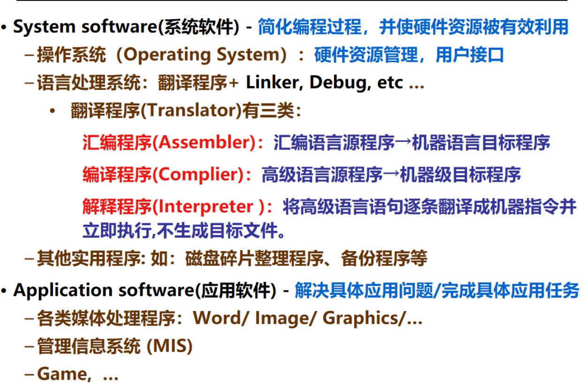
  - 翻译程序把元语言/程序翻译成目标语言/程序
- 指令由操作码字段和地址字段组成
  - 指令执行的各阶段可以进一步细分为若干个微操作，微操作需要相应的控制信号（通过控制线发出）。CPU中所有微操作都由时钟信号进行定时，时钟信号（clock signal）的宽度为一个时钟周期（clock cycle）。一条指令的执行时间包含一个或多个时钟周期
  - 例题：
  - 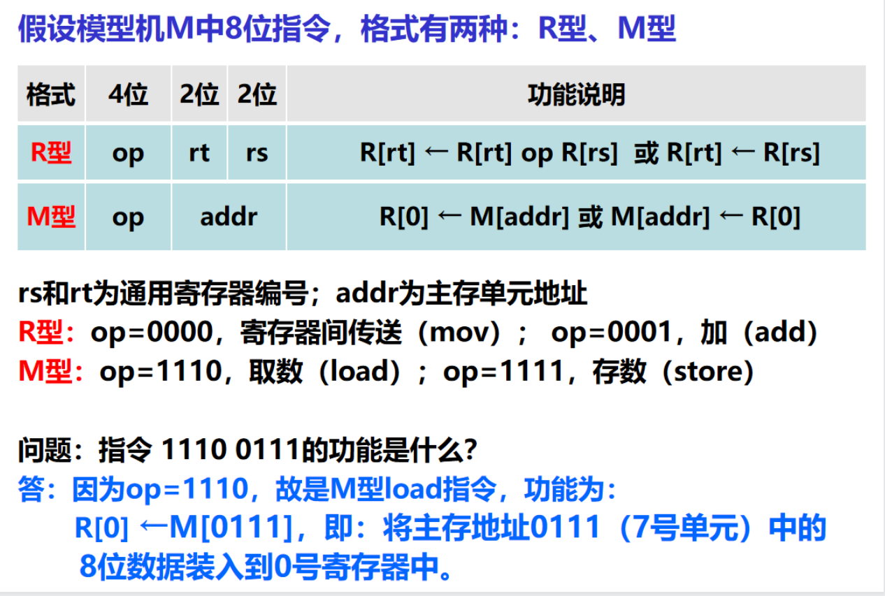
  - 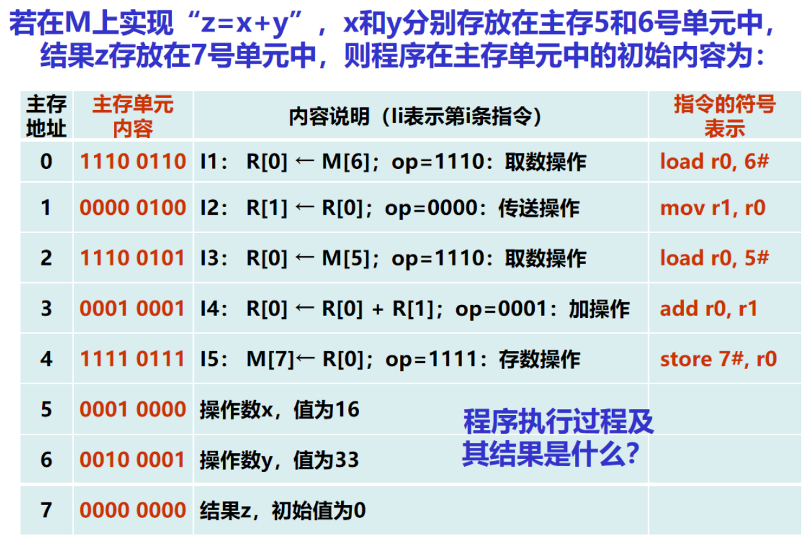
  - 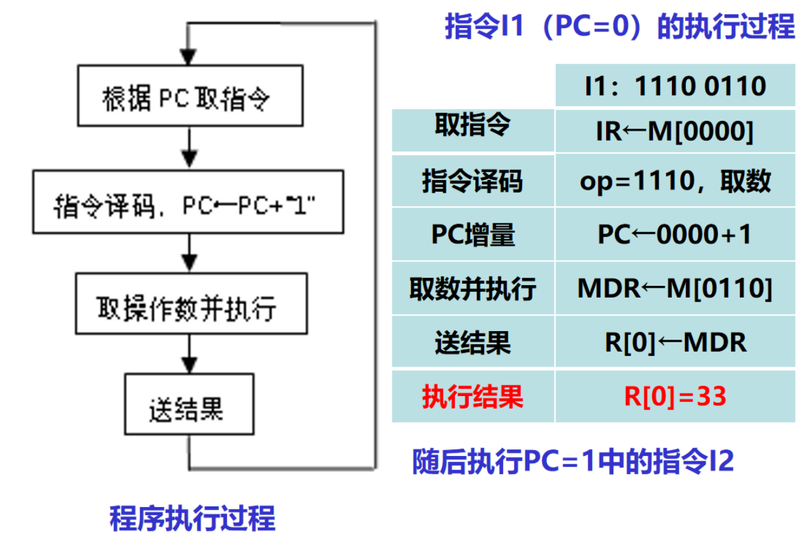
  - 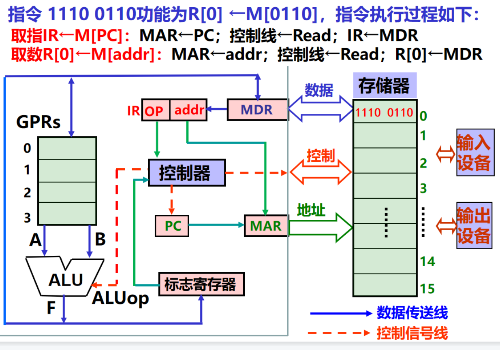
  - 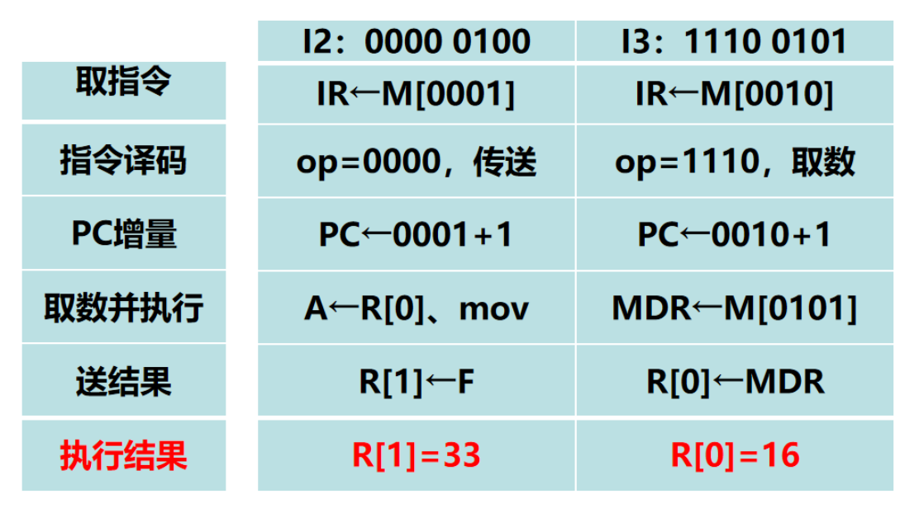
  - 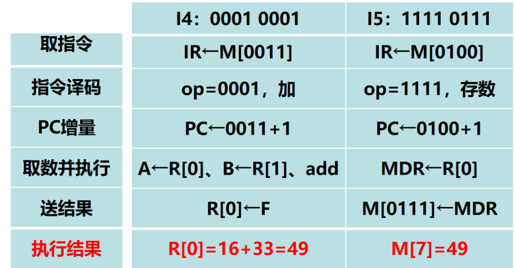

### 程序的开发与运行

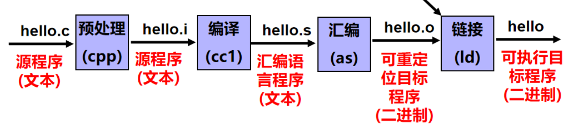

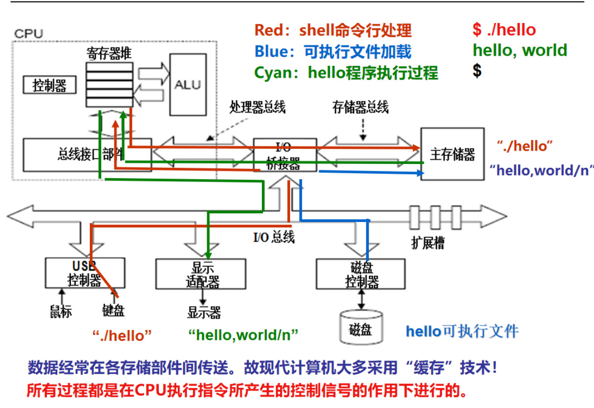

- shell程序将用户从键盘的输入读入cpu寄存器再到主存，形成缓冲字符串“./hello”，就受到回车后shell调用系统内核中的历程，加载可执行文件hello到存储器，将第一条指令存入pc开始执行程序

### 计算机系统层次结构

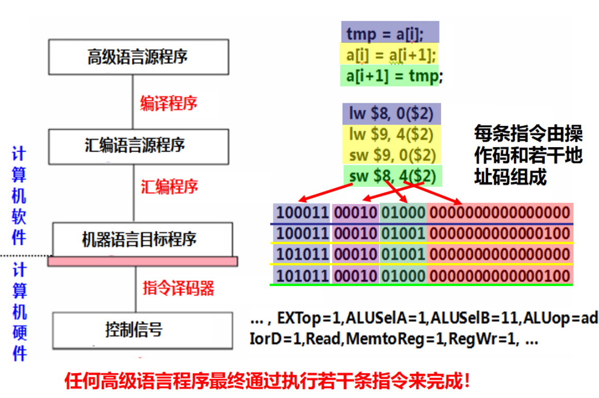

| 机器语言编程             |  |
| ------------------------ | ------------------------------------------------------------ |
| 汇编语言编程             |  |
| 现代计算机用高级语言编程 |  |

- 语言处理系统包括：各种语言处理程序（如编译、汇编、链接）、运行时系统（如库函数，调试、优化等功能）
- 操作系统包括人机交互界面、提供服务功能的内核例程

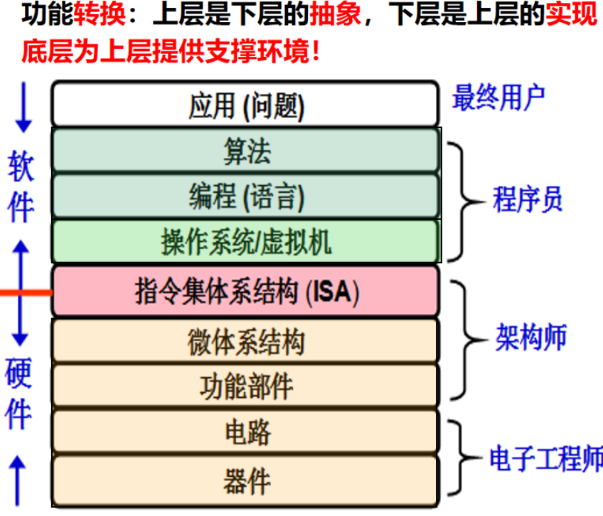

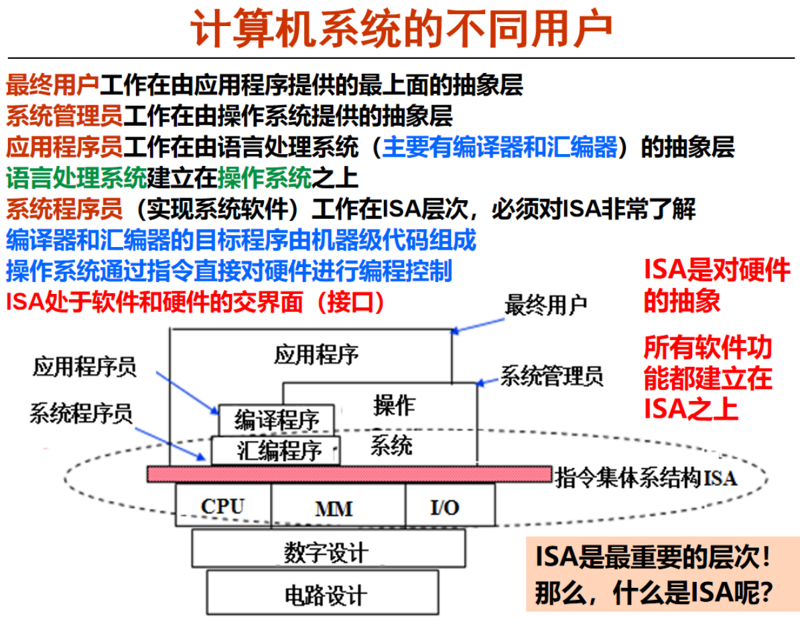

- isa规定了软件如何使用硬件

  - 可执行的指令的集合，包括指令格式、操作种类以及每种操作对应的操作数的相应规定；
  - 指令可以接受的操作数的类型；
  - 操作数所能存放的寄存器组的结构，包括每个寄存器的名称、编号、长度和用途；
  - 操作数所能存放的存储空间的大小和编址方式；
  - 操作数在存储空间存放时按照大端还是小端方式存放；
  - 指令获取操作数的方式，即寻址方式；
  - 指令执行过程的控制方式，包括程序计数器、条件码定义等

  | 前端 | 高级语言程序->中间代码 | 词法、语法及语义分析中间代码生成 | 遵循语言规范         |
  | ---- | ---------------------- | -------------------------------- | -------------------- |
  | 后端 | 中间代码->目标代码     | 目标代码生成及优化               | 遵循ISA规范和ABI规范 |

- ABI是为运行在特定ISA及特定操作系统之上的应用程序所遵循的一种机器级目标代码层接口描述了应用程序和操作系统之间、应用程序和所调用的库之间、不同组成部分（如过程或函数）之间在较低层次上的机器级代码接口。

### 计算机性能评估
- 两种：
    - 完成任务需要的时间：响应时间、执行时间、等待时间
    - 一定时间完成的任务：吞吐率、带宽
    - 
#### cpi
- cpi每条指令用时
    - 
- cpi：每条指令平均需要的时钟周期数目
- 对于某一条特定的指令而言，其CPI是一个确定的值。但是，对于某一个程 序或一台机器而言，其CPI是一个平均值，表示该程序或该机器指令集中每 条指令执行时平均需要多少时钟周期。
    - 
    - 也就是总时钟周期数/指令数目
- 
#### mips（定点执行速度）
- 定点指令执行速度，是一个平均值，用时钟频率/平均cpi
    - 不同机器指令集不同，不同指令不同
    - 具有一定局限性，不一定真实反应速度
    - 
    - 题意：alu加快一倍，计算cpi等
- 浮点操作速度
    - 每秒浮点运算次数所 量测的实际上就是浮点运算器的执行速度。而最常用来测量每秒浮点运算次数的基 准程序(benchmark)之一，就是Linpack。
    - 
- 基准程序可以用于评估计算机性能，但是可能会被针对性优化（作弊）
#### amdahl定律
- 对系统中某部分(硬件或软件)进行更新所带来的系统
  性能改进程度，取决于该部分被使用的频率或其执行时间占总执行
  时间的比例。
- 
## 数据的表示和运算
#### 进制转化
- 2<=>10
    -整数部分除2取余数（低位到高位），小数部分乘2取整数（高位到低位）
- 8/16<=>2
    - 一位转化为一组为3/4位的2进制组
### 数值数据的表示
- 补码：一个负数的补码等于模减该负数的绝对值。对于某一确定的模，某数减去小于模的另一数，总可以用该数加上另一数负数的补码来代替。
    - 
    - 即补码为：对应正数各位取反、末位加1
        - [X]补=2^n+X(mod 2^n)（n是码的长度位数）
    - 一些常见的特殊值
        - 0:0000...
        - -1:1111...
        - 2147483648:1000...
        - 2147483647:0111...
    - 补码的补码是原码
        - 因此通过补码求原码的方式和求补码的方式是相同的
    - $[x]_补$和$[-x]_补$的转化同样是各位取反（包括符号位），末尾加一
- 
- c中数据表示与转化
    - c90中`-2147483648`与`-2147483647-1`
        - 2147483648 不是一个整数常量，而是一个表达式，它将一元减号运算符应用于 2147483648 这个整数常量。
        - 由于 2147483648 超出了有符号整数的范围，它被视为无符号长整型 (unsigned int) 类型。
        - 因此，-2147483648 实际上是对 2147483648 进行无符号算术运算的结果，它的值仍然是 2147483648**非常特殊的一个值**。
        - 而 -2147483647-1 是一个有符号整型 (int) 类型的常量，它的值是 -2147483648。
        - 而对于“int i=-2147483648;”，则“i <2147483647”的执行结果为true，因为是按照int类型来处理的
        - 

        - 
- 例：
    - 造成不同的原因是第一次比较都转化为unsigned int（那么-1就变成了一个非常大的无符号整数）
    - 第二次比较时转化为了int    
#### 科学计数法与浮点数
- 
    - 阶码用移码表示，就是补码第一位取反，即1表是正，0表示负
- 
    - 最大正值：0111111 … （23个1）= (-1)^0 * (2 - epsilon) * 2^(127)
    - 00000000 00000000 … （23个0）= (-1)^0 * (0.5) * 2^(-126)
    - 阶码0000 0001(-126)~1111 1110(127)，全0全1表示特殊值
        - tip：可以这样理解，全零到全1是一个逐渐增大的过程（0～256）用中位数127均分为正负两部分
        - 阶码的值减去偏置常数（127）可以得到真实值·
    - 划分1｜8｜23；1｜11｜52
    - 例：
    - 
- 特殊值
    - 符号位为1/0，尾数阶数全为0表示0
    - 阶数为0，尾数不为0表示非规格化浮点数，即为了可以表示更小的浮点数，通过去掉前导的1来实现。
    - 尾数为0，阶数全1表示正负无穷inf
    - 尾数不为零，阶数全为1表示非数字NaN
    - 
    - 
    - 
- 向系统输入一个不可表示的数时，系统会将其转化为最近的课表示数字。
- 例：浮点数转化：
    - 先把10进制数分为整数部分和小数部分，然后分别转化为2进制数¹²。
    - 整数部分用除以2，反向取余数的方法，直到商为0终止。例如987转化为二进制数是1111011011。
    - 小数部分用乘以2，取整数部分的方法，直到小数部分为0或者位数足够多。例如0.25转化为二进制数是0.01。
    - 然后把整数部分和小数部分拼接起来，得到一个完整的二进制数。例如987.25转化为二进制数是1111011011.01。
    - 接着把二进制数规格化，即把小数点移动到最高位之后，并记录移动了多少位。例如1111011011.01规格化后是1.11101101101*2^9。
    - 最后把符号位、阶码和尾数提取出来并拼接起来，得到32位2进制浮点数。符号位是0表示正号；阶码是移动的位数加上偏移量127，即9+127=136，再转化为二进制得到10001000；尾数是小数部分的23位，不足的用0补齐，得到11101101101000000000000。所以最终结果是01000100011101101101000000000000。
### 非数值数据的表示
#### 逻辑数据
- 用一位表示
#### 西文字符
- ascll码，不超过256个，7/8个二进制表示
- 包含数字、字母、专用符号、控制字符
- 8859
#### 汉字字符
- 输入码:对汉字用相应按键进行编码表示，用于输入
- 内码:用于在系统中进行存储、查找、传送等处理 
- 字模点阵或轮廓描述: 描述汉字字模点阵或轮廓，用于显示/打印
- 为与ASCII码区别，将国标码的两个字节的第一位置“1”后得到一种汉字内码
    - 

- gb2312，gbk...
#### 发展
- Unicoide 的全称是 Universal Multiple-Octet Coded Character Set（通用多八位字符集，简称 UCS）。Unicode 在一个字符集中包含了世界上所有文字和符号，统一编码，来终结不同编码产生乱码的问题。
- UTF-8:一个uncode占用4个字节，utf8对不同序号的字符用不同（1-4）个字节进行存储，节约空间，是一种变长编码方式。
#### 显示
- 字形描述：
    - 点阵描述
    - 轮廓描述（矢量字体）
### 数据的宽度和存储
#### 宽度和单位
- 二进制中的一位（0/1）是计算机中信息的最小单位，记为bit比特
- 8个bit（b）组成一个字节（位组），记为Byte（B）
- 字：不同计算机中一个字代表的长度不同（2、4...个字节）
- 字长：等于CPU内部总线的宽度、运算器的位数、通用寄存器的宽 度等。数据通路的宽度。
- 
#### 存储和排列
- 最低有效位lsb和最高有效位msb表示数的高地位（对于带符号数msb就是符号位）
- 
- 如：`FF AF 00 23`
    - 从大端还原：`FF AF 00 23`
    - 从小端还原：`23 00 AF FF`
        - 一个字节八个比特即两个十六进制位
        - 块内元素顺序保持不变
- 大端小端需要统一数据格式才能相互传递信息
#### 例题
- p58 2.26（综）
## 数据的运算
- 移位运算：
    - 逻辑移位（无符号数）：移出、补零
    - 算术移位（带符号数）：左移补零、右移补符号位
    - 移动时舍去1可能发生溢出
- 扩展可截断：（类型转化时可能需要）
    - 扩展：无符号数前面补0，有符号数补符号
    - 截断：直接舍去高位
    - 
    - 

### 整数加减
- 整数在计算机中的表示形式（机器数）是其补码，并且用补码可以统一加减法
    - $[-y]_补$=~$[y]_补$+1
    - 
- 
### 整数乘除
    