# 网络介绍
## internet构成
- 组成角度
    - 计算设备（主机/端系统）
    - 通讯设备：电缆、无线电频谱
      - 传输速率用bit/s计量
    - 路由器&交换机
- API: 与因特网相连的端系统提供了一个应用程序编程接口
- 协议：一个协议定义了在两个或多个通信实体之间交换的报文格式和次序, 以及报文发送和接受一条报文或其他事情所采取的动作.
- 网络的网络：多层ISP（网络服务商）
    - 低层isp是高层isp客户，高层isp间互联
## 如何连接到internet
- **组成**
    - 网络边缘edge：端系统、服务器
    - 网络接入access networks：物理媒介，有线无线连接，将端系统连接到边缘路由器的网络（光缆、**无线**路由器，链接终端的“最后一公里”）
    - 网络核心network core：交换机、路由器
- 家庭接入
    - 电话线dsl
    - 电缆
    - 光纤ftth
    - 卫星
- 公司接入
    - 以太网
    - wifi
- 广域无线接入
    - 广域网
    - wifi
    - 4g，5g，lte
- 物理媒介：
    - 光缆，双绞铜线（网线），同轴电缆
    - 无线传输wifi，卫星
## 如何通过internet传输数据
- 共享连接代替点对点专有连接，节约资源
- 电路交换（网络核心）：
    - 类似早起电话交换，点对点传输，线路专用
    - 优点：资源预留，速度质量有保证
    - 缺点：线路复杂，延迟，不能充分利用线路资源
- 分组（包）交换
    - 非独立处理，将数据划分为小块
    - 问题：拥塞问题，包可能需要在交换机排队暂时存储在输出队列，等待传输，超出容量可能发生丢包
    - 优点：充分利用互联网资源
- 统计复用：
    - 所有用户不会同时使用网络，因此可以许诺给每个用户大于线路承载总合的带宽
 ## 互联网层次和模型
 ### 层次
 - 物理层：通过连接传输bits
     - 规定物理信号传输方式及接口规格
- 数据链路层：bits->帧
    - 检查bits，将bits转化为有用的数据
    - 在单线上传输信息，控制局域网
- 网络层：实现多线连接（ip）
    - 让多个链路通信，自动选路
    - 拥塞控制
- 传输层：在接通的机器间进行端到端应用的连接（tcp，udp）
- 应用层：支持网络应用（ftp，http）
    - 融合session和presentation
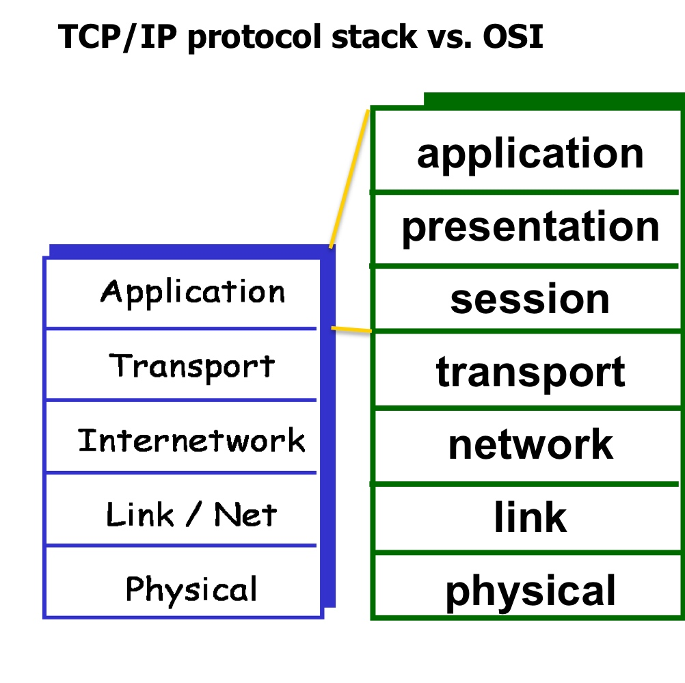
- osi7层，tcp5层
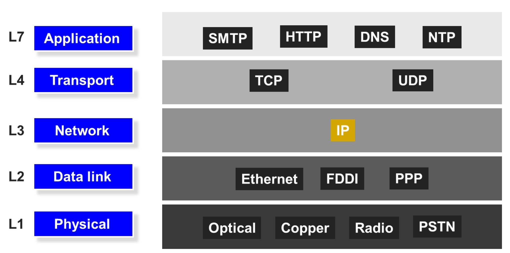
### 实现过程
- 每一层对数据前加上包头，接收时再逐层解析
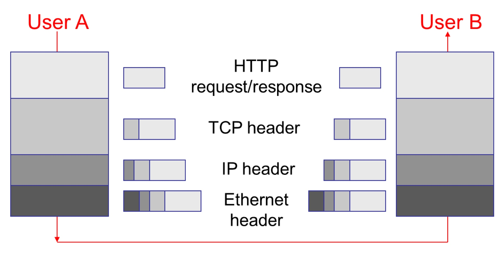
- 其中应用层更需要对数据进行分割

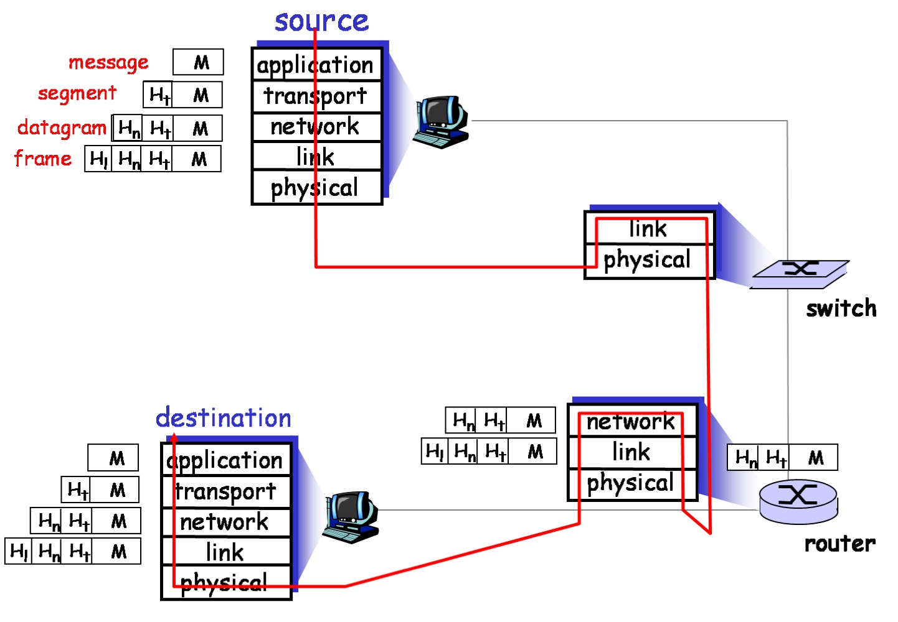
### 优缺点
- 优点：
    - 降低复杂度
    - 提高灵活度
- 缺点：
    - 过高负载（很短的信息也需要添加一系列的包头）
    - 层次划分过严，高层可能需要一些低层次信息
## 互联网性能评估
### 延迟
- 概念：一个数据从发出到收到需要多少时间

- 时延=传输时延transmission+传播时延propagation+排队时延queuing+处理时延processing
    - 传输：把包推进链路需要多长时间
        - 包大小/链路宽度（transmission rate）
    - 传播：在线路上传输需要的时间，由线路的物理媒介决定
        - 线路长度/传输速度
    - **例**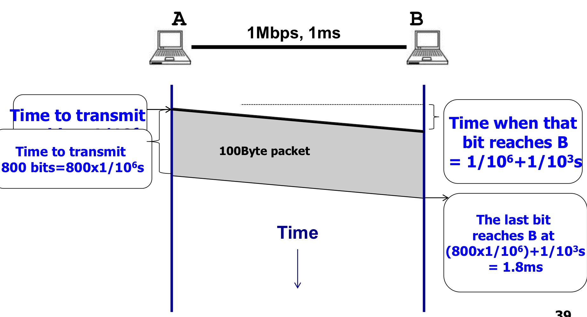
        - 按照最后一个bit传输完成计算
        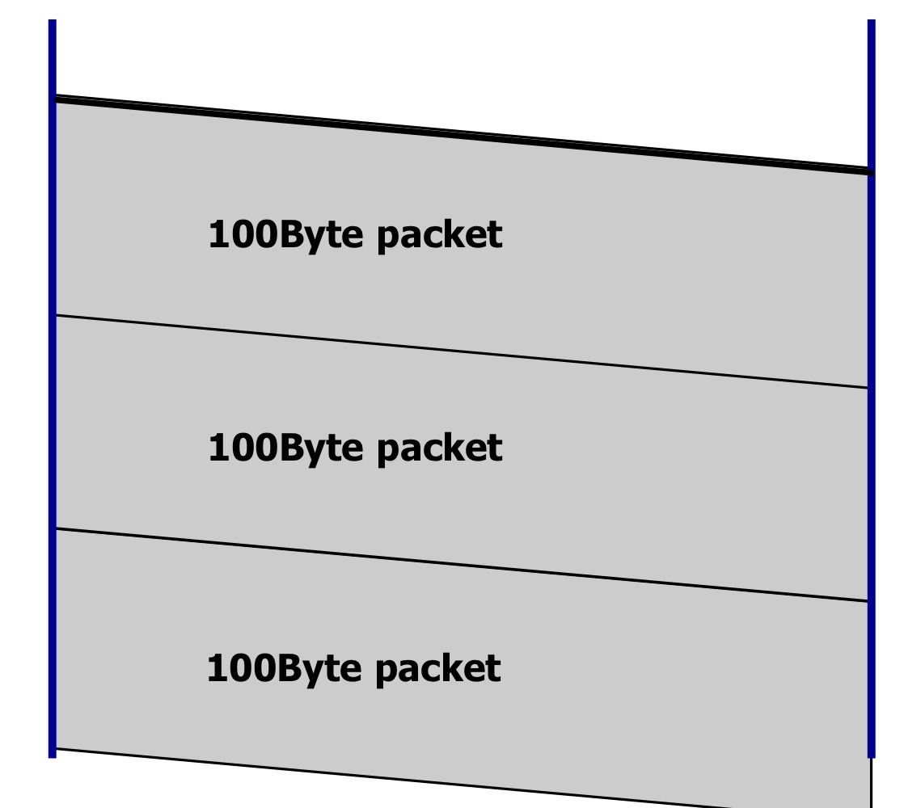
        - 大包先拆分再传输
    - 排队：
        - 
        - 因素：
            - 到达速率
            - 到达分布（集中/分散）
            - 传出速率
        - **评价**：均值/方差
            - 平均排队数目L=平均到达速率A*平均等待时间W
    - 处理：芯片处理能力决定
    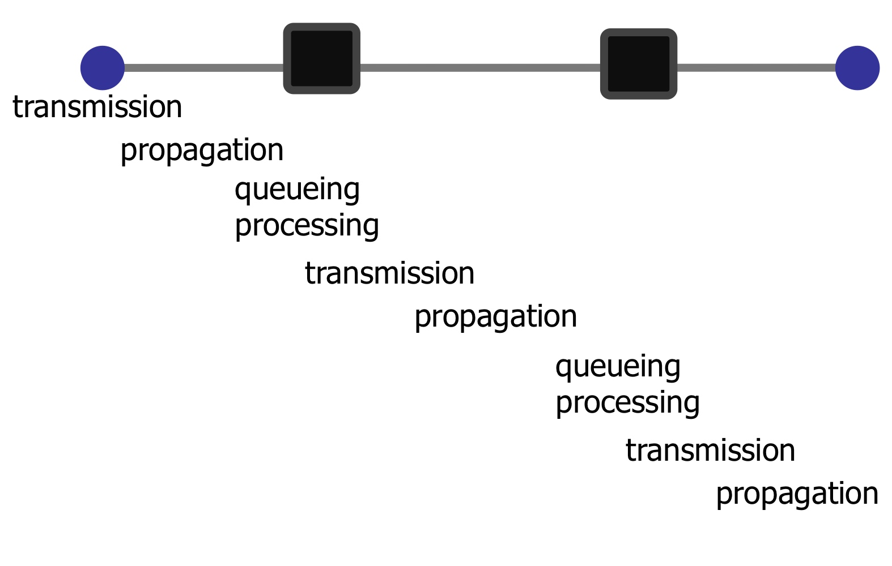
### 丢包
- 在传输过程中总共丢失了几个包
- 计算：乘法，每一段传输成功概率想乘
### 吞吐量
- 计算
    - 传输速率R（bits/sec）（由最细/慢的部分决定）
    - 文件大小F
    - 传输时间=F/R+传播延时
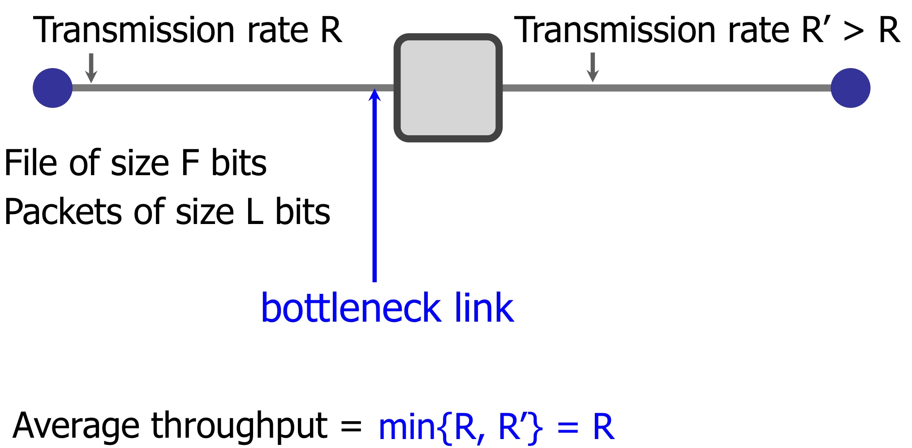
# 链路层
### 基本服务
#### 将数据打包成帧，添加头尾
- 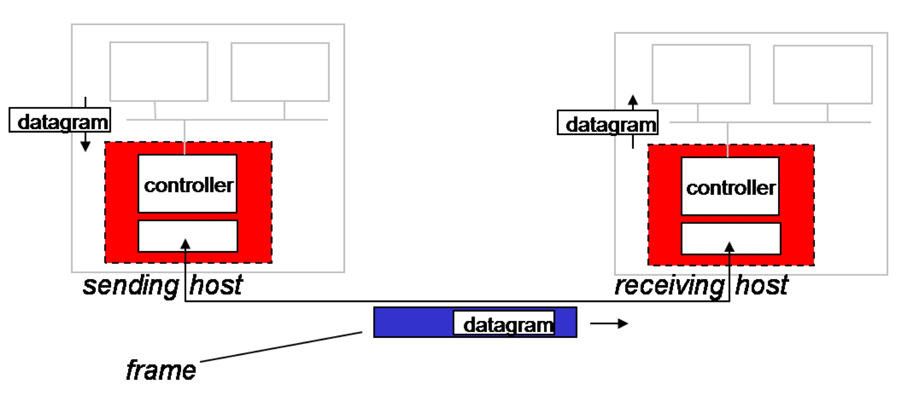

#### 连通
- 性质
    - 协调多设备连接（多设备接入网络的控制）
    - mac局部地址进行标识区分
    - 半双工、全双工，是否双向同时传输
- 连接方式
    - 点对点连接
    - 广播（无线局域网lan、卫星无线通信）
- MAC
    - 分布式算法、控制多设备接入的网络，组织多个设备同时传输数据，决定让那一个设备开始数据传输
    - 三种技术：
        - 信道划分，分给不同节点
        - 轮流传输
        - 随机接入，提供发生冲突后的恢复解决方式
#### 在链路层保证可靠传输（不是所有链路层都一定实现了）
- 用光纤传输时通常不需要保证，因为出错概率很低，是小概率事件
    - 无线连接出错的概率很高
    - 目的是为了弥补物理层的缺陷
- flow control（流控）：当接收端出现故障、繁忙时停止、暂停传输
    - 停止等待协议：接收端接受完成后发出ACK信号，告知传输完成，可以继续发送
        - 如果帧比较小，效率比较低（传回ack、信号需要一定的时间）
    - 滑动窗口模式：发送方和接收方各有一个固定大小的缓冲区（buffer），用来存储发送或接收的数据。发送方会根据接收方的反馈（ACK）来调整自己的发送窗口（window），即可以连续发送的数据包的数量（还要对帧进行编号）。接收方会根据自己的缓冲区空闲情况来调整自己的接收窗口（window），即可以连续接收的数据包的数量，并通过ACK告知发送方。
        - 总体思路是发送端不断发送窗口内的包，接收端收到后回返回附带包序号的ack，发送端收到ack后对滑动窗口进行平移
        - 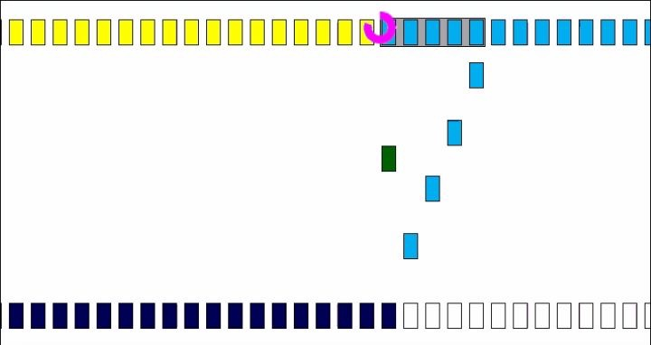
        - 错误处理（丢包）
            - go back n：回到发生错误（没有ack）的位置为起点，重新发送（有线网络常用）
            - 只发送缺失的包（无线网络常用）
#### 错误检查和纠正
- 处理信号衰减、噪声造成的错误，进行纠正
- 
- EDC为较长则纠错能力强，但浪费相应的也更多
- **CRC纠错算法**
    - 例：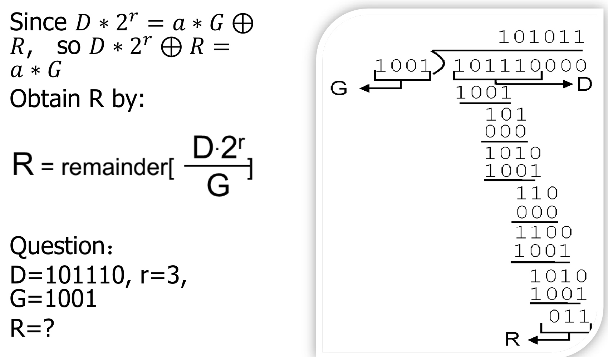

## 局域网
### token ring 令牌环
- 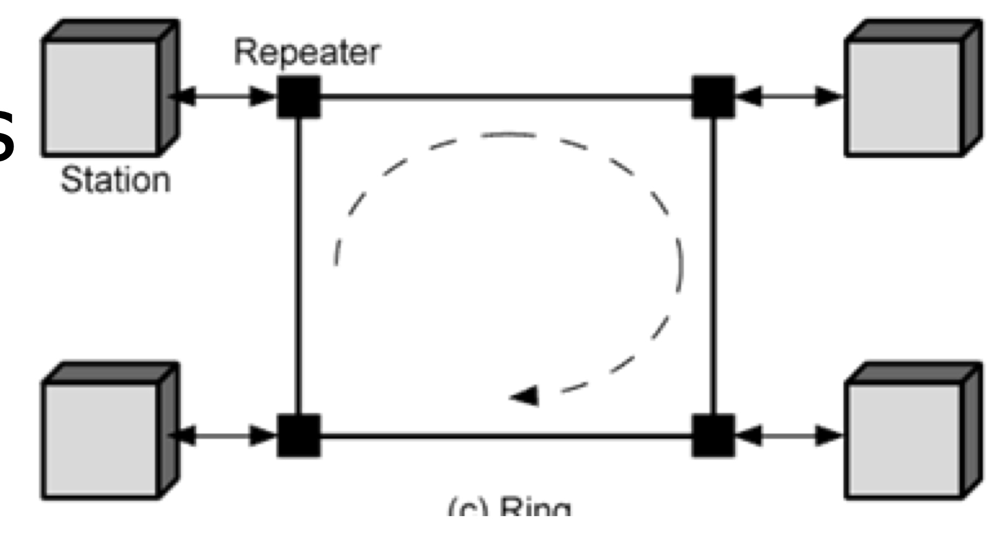
- 数据环形单向传输
- 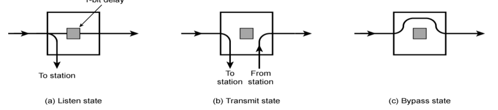
- 有一个token在环形中循环，当一个节点要发送数据时会捕捉token对其进行标记，并在末尾加上数据，放回环形，环绕一周，其它节点发现token被修改并指向自己时会获取其中的信息。循环一周后发送者将一个新的token放回环形（同时只能在环形中传递一条信息）
    - 
### 以太网
- 链路模式
    - 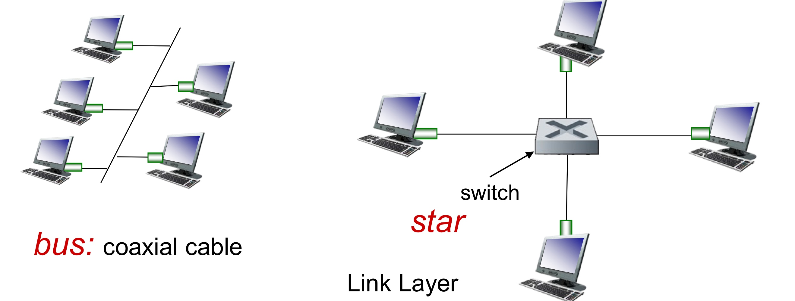
    - bus（早期模式），数据公开传播
    - 通过switch交换机点对点传输
- 特点：
    - 不需要先建立连接就可以先收发信息
    - 不可靠，发送端不知道接收端是否收到信息，处理不了丢包
- 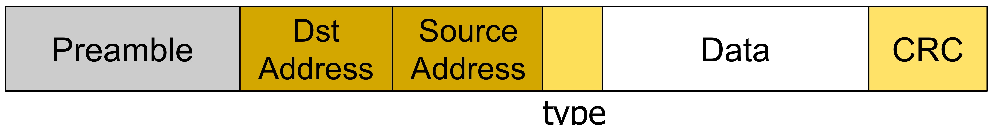
    - 不对帧编号（不用滑动窗口）
    - Preamble:7bytes用于同步时钟，1bytes用于指示帧的开始
    - address:6bytes
    - type:2bytes
    - data:max1500bytes，min46bytes
    - crc:4bytes
- MAC地址：48bits
    - 每个网卡有自己固定的mac地址
- 分割帧：
    - 使用哨兵：01111110表示开始，01111111表示结束
    - 需要防止其它部分出现哨兵，通过在发送端如果发现出现连续5个1就插0，接受时自动删除0
    - 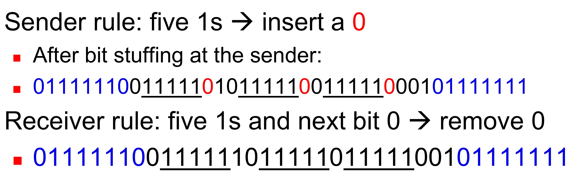

